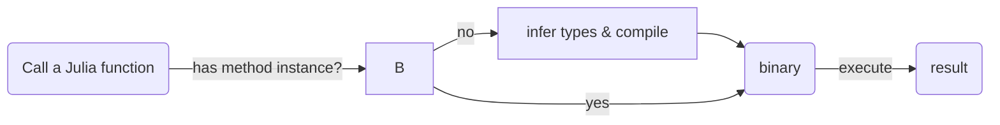
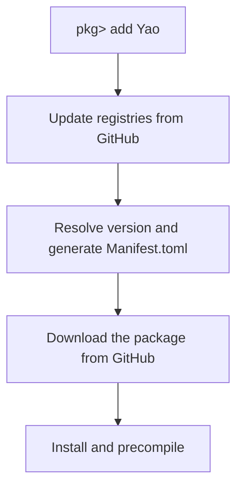

## An Introduction to the Julia programming language

### A survey
What programming language do you use? Do you have any pain point about this language?

### What is JuliaLang?
**A modern, open-source, high performance programming lanaguage**

JuliaLang was born in 2012 in MIT, now is maintained by Julia Computing Inc. located in Boston, US. Founders are Jeff Bezanson, Alan Edelman, Stefan Karpinski, Viral B. Shah.

JuliaLang is open-source, its code is maintained on [Github](https://github.com/JuliaLang/julia)(https://github.com/JuliaLang/julia) and it open source LICENSE is MIT.
Julia packages can be found on [JuliaHub](https://juliahub.com/ui/Packages), most of them are open-source.

It is designed for speed.

    

### Reference
[arXiv:1209.5145](https://arxiv.org/abs/1209.5145)

**Julia: A Fast Dynamic Language for Technical Computing**

-- Jeff Bezanson, Stefan Karpinski, Viral B. Shah, Alan Edelman

**Dynamic** languages have become popular for scientific computing. They are generally considered highly productive, but lacking in performance. This paper presents Julia, a new dynamic language for technical computing, designed for performance from the beginning by adapting and extending modern programming language techniques. A design based on generic functions and a rich type system simultaneously enables an expressive programming model and successful type inference, leading to good performance for a wide range of programs. This makes it possible for much of the Julia library to be written in Julia itself, while also incorporating best-of-breed C and Fortran libraries.

### Terms explained
- dynamic programming language: In computer science, a dynamic programming language is a class of high-level programming languages, which at runtime execute many common programming behaviours that static programming languages perform during compilation. These behaviors could include an extension of the program, by adding new code, by extending objects and definitions, or by modifying the type system.
- type: In a programming language, a type is a description of a set of values and a set of allowed operations on those values.
- generic function: In computer programming, a generic function is a function defined for polymorphism.
- type inference: Type inference refers to the automatic detection of the type of an expression in a formal language.


### The two language problem
**Executing a C program**

```jl
# A notebook utility to run code in a terminal style
with_terminal() do
	# display the file
	run(`cat clib/demo.c`)
end# compile to a shared library by piping C_code to gcc;
```

**C code needs to be compiled**

**One can use `Libdl` package to open a shared library**


**Typed code may overflow, but is fast!**

[learn more about calling C code in Julia](https://docs.julialang.org/en/v1/manual/calling-c-and-fortran-code/)

**Executing a Pyhton Program**

**Dynamic programming language does not require compiling"**
**Dynamic typed language is more flexible, but slow!**

**The reason why dynamic typed language is slow is related to caching.**
Dynamic typed language uses `Box(type, *data)` to represent an object.

Cache miss!


### Two languages, e.g. Python & C/C++?
**From the maintainance's perspective**

- Requires a build system and configuration files,
- Not easy to train new developers.

**There are many problems can not be vectorized**
- Monte Carlo method and simulated annealing method,
- Generic Tensor Network method: the tensor elements has tropical algebra or finite field algebra,
- Branching and bound.


### Julia's solution
NOTE: I should open a Julia REPL now!

**1. Your computer gets a Julia program**

Method instance is a compiled binary of a function for specific input types. When the function is written, the binary is not yet generated.

**2. When calling a function, the Julia compiler infers types of variables on an intermediate representation (IR)**




**One can use `@code_warntype` or `@code_typed` to show this intermediate representation.**

**Sometimes, type can not be uniquely determined at the runtime. This is called "type unstable".**

```jl
sco("""
	supertype(Float64)
""")
```

**3. The typed program is then compiled to LLVM IR**


LLVM is a set of compiler and toolchain technologies that can be used to develop a front end for any programming language and a back end for any instruction set architecture. LLVM is the backend of multiple languages, including Julia, Rust, Swift and Kotlin.


**4. LLVM IR does some optimization, and then compiled to binary code.**

Aftering calling a function, a method instance will be generated.

A new method will be generatd whenever there is a new type as the input.

Dynamically generating method instances is also called Just-in-time compiling (JIT), the secret why Julia is fast!

**The key ingredients of performance**
- Rich type information, provided naturally by multiple dispatch;
- aggressive code specialization against run-time types;
- JIT compilation using the LLVM compiler framework.

### Julia's type system
1. Abstract types, which may have declared subtypes and supertypes (a subtype relation is declared using the notation Sub <: Super) 
2. Composite types (similar to C structs), which have named fields and declared supertypes 
3. Bits types, whose values are represented as bit strings, and which have declared supertypes 
4. Tuples, immutable ordered collections of values 
5. Union types, abstract types constructed from other types via set union

**Numbers**
**Type hierachy in Julia is a tree (without multiple inheritance)**

**Abstract types does not have fields, while composite types have**

**We have only finite primitive types on a machine, they are those supported natively by computer instruction.**

**`Any` is a super type of any other type**

**A type contains two parts: type name and type parameters**

**ComplexF64 is a bits type, it has fixed size**

The size of Complex{BigFloat} is not true! It returns the pointer size!

**A type can be neither abstract nor concrete.**

To represent a complex number with its real and imaginary parts being floating point numbers


**We use Union to represent the union of two types**

NOTE: it is similar to multiple inheritance, but Union can not have subtype!

**You can make an alias for a type name if you think it is too long**

### Case study: Vector element type and speed

**Any type vector is flexible. You can add any element into it.**

**Fixed typed vector is more restrictive.**


**But type stable vectors are faster!**

### Multiple dispatch

<: is the symbol for sybtyping， A <: B means A is a subtype of B.

**One can implement the same function on different types**

The most general one as the fall back method

**The most concrete method is called**

**Be careful about the ambiguity error!**

The combination of two types.

Quiz: How many method instances are generated for fight so far?

**A final comment: do not abuse the type system, otherwise the main memory might explode for generating too many functions.**


A "zero" cost implementation

However, this violates the Performance Tips, since it transfers the run-time to compile time.

### Multiple dispatch is more powerful than object-oriented programming!

Implement addition in Python.

Implement addition in Julia

**Multiple dispatch is easier to extend!**

If C wants to extend this method to a new type Z.

**Julia function space is exponetially large!**
Quiz: If a function has parameters, and the module has types, how many different functions can be generated?

If it is an object-oriented language like Python？

**Summary**
- Multiple dispatch is a feature of some programming languages in which a function or method can be dynamically dispatched based on the run-time type.

- Julia's mutiple dispatch provides exponential abstraction power comparing with an object-oriented language.

- By carefully designed type system, we can program in an exponentially large function space.

### Tuple, Array and broadcasting

**Tuple has fixed memory layout, but array does not.**


**Boardcasting**

**Broadcasting is fast (loop fusing)!**

**Broadcasting over non-concrete element types may be type unstable.**

### Julia package development

The file structure of a package




**Unit Test**


