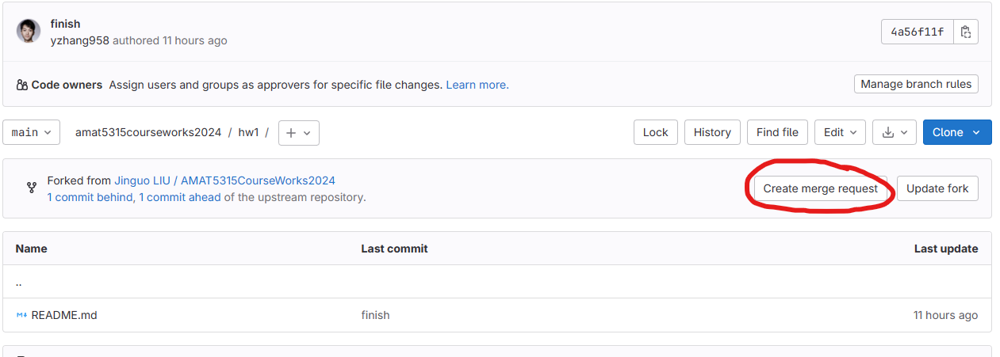

<style>
    .reveal h1, .reveal h2, .reveal h3, .reveal h4, .reveal h5 {
                  text-transform: none;
		  }
    .reveal p {
        text-align: left;
    }
    .reveal ul {
        display: block;
    }
    .reveal ol {
        display: block;
    }
    .reveal p:has(> img){
        text-align: center;
    }
    h3 {
        border-bottom: 2px solid yellow;
        padding: 10px;
    }
</style>


## The workflow to set up the environment and complete homework 

#### Yidai ZHANG 

---

##  Install WSL
##  Set up the SSH
##  Github&Gitlab
##  Submit homework


---

## Install wsl
###### https://learn.microsoft.com/en-us/windows/wsl/install 
#### install wsl by typing 

```bash
wsl --install
```

#### in the powershell.

#### Restart the computer after installation.

---

 After install WSL in your windows prompt, you must restart your computer, so remember to save your files and data before this action. After you restart your computer, a pop-up window will automatically appear that says welcome to Ubuntu, and you need to follow the steps to set your new UNIX username and new password, and retry your password again.
Installation successful.


---

~~~bash
Ubuntu 已安装。
正在启动 Ubuntu...
Installing, this may take a few minutes...
Please create a default UNIX user account. The username does not 
For more information visit: https://aka.ms/wslusers
Enter new UNIX username: yidai
New password:
Retype new password:
passwd: password updated successfully
Installation successful!
To run a command as administrator (user "root"), use "sudo <command>".
See "man sudo_root" for details.

Welcome to Ubuntu 22.04.3 LTS (GNU/Linux 5.15.133....)
~~~


~~~bash
To run a command as administrator (user "root"), use "sudo <command>".
See "man sudo_root" for details.

yidai@DELL:~$
~~~


---

## Set up the SSH
```bash
yidai@DELL:~$ ssh-keygen
Generating public/private rsa key pair.
Enter file in which to save the key (/home/yidai/.ssh/id_rsa):
Created directory '/home/yidai/.ssh'.
Enter passphrase (empty for no passphrase):
Enter same passphrase again:
Your identification has been saved in /home/yidai/.ssh/id_rsa
Your public key has been saved in /home/yidai/.ssh/id_rsa.pub
The key fingerprint is:
SHA256:+RLizEJBI6oD0UOcgKfhU1qlS1GQSkw6CnOs+V4DYvA yidai@DELL
The key's randomart image is:
+---[RSA 3072]----+
...

```


---

```bash
yidai@DELL:~$ cd /home/yidai/.ssh
yidai@DELL:~/.ssh$ ls
id_rsa  id_rsa.pub
yidai@DELL:~/.ssh$ cat id_rsa.pub
ssh-rsa AAAAB3NzaC1yc2EAAAADAQABAAABgQDUzOvlhZc8LZn6EaFyo6RZ6Xy4DZSgdS5oZ
``` 


```bash
yidai@DELL:~/.ssh$ ssh user01@10.100.0.179
The authenticity of host '10.100.0.179 (10.100.0.179)' can't be establish
ED25519 key fingerprint is SHA256:FIBX4TxQ61700g0bRrUh3Qu/60cc
This key is not known by any other names
Are you sure you want to continue connecting (yes/no/[fingerprint])? yes
Warning: Permanently added '10.100.0.179' (ED25519) to the list 
user01@10.100.0.179's password:
Welcome to Ubuntu 22.04.2 LTS (GNU/Linux 5.19.0-45-generic x86_64)
```


---

~~~bash
user01@amat-course-site:~$ ls
user01@amat-course-site:~$ lscpu
user01@amat-course-site:~$ lscpu > hw1.txt
user01@amat-course-site:~$ ls
user01@amat-course-site:~$ cat hw1.txt
~~~
ctrl + D to exit/quit

~~~bash
yidai@DELL:~/.ssh$ touch ~/.ssh/config
yidai@DELL:~/.ssh$ chmod 600 ~/.ssh/config
yidai@DELL:~/.ssh$ vim config
~~~

In vim, type `i` to enter the insert mode, and type the following content:
```bash
Host amat5315
    HostName 10.100.0.179
    User <user01> # replace <user01> with your username
```
Then type `Esc` to exit the insert mode, `:wq` to save and quit.
``:q!`` to quit without saving

```

---

# Github&Gitlab

---

#### https://github.com
#### https://code.hkust-gz.edu.cn

Remember to set up your SSH key in your github and gitlab account, or you will not be able to push/pull your homework to the remote repository.

---

### Git concepts
- **repository**: a repository is a collection of files and folders. A repository can be local or remote. A local repository is a folder on your local machine. A remote repository is a folder on a remote server. A remote repository can be accessed with a URL, e.g.
    Our course repository is
    ```
    https://github.com/GiggleLiu/ModernScientificComputing2024.git
    ```
    Our homework repository is
    ```
    https://github.com/CodingThrust/AMAT5315HW.git
    ```
    You can clone a remote repository with `git clone remote-url`. You can check the current remote repository with `git remote -v`.

---

- **commit**: a commit is a snapshot of the repository. You can create a commit with `git commit -m 'commit message'`. You can check the commit history with `git log`.
- **branch**: a branch is a pointer to a commit. The default branch is `master/main`. You can create a new branch with `git branch new-branch-name`. You can switch to a branch with `git checkout new-branch-name / git switch new-branch-name`. You can check the current branch with `git branch`.
- **remote**: a remote is a pointer to a remote repository. You can check the current remote with `git remote -v`. You can add a new remote with `git remote add remote-name remote-url`. You can remove a remote with `git remote remove remote-name`.

---

- **fork**: a fork is a copy of a remote repository. You can fork a remote repository with `git fork remote-url`. You can check the current fork with `git remote -v`. You can add a new fork with `git remote add fork-name fork-url`. You can remove a fork with `git remote remove fork-name`.
- **rebasing**: rebasing is a way to update your local repository with the remote repository. You can rebase your local repository with `git pull --rebase`. You can rebase a branch with `git pull --rebase remote-name branch-name`. You can rebase a fork with `git pull --rebase fork-name branch-name`.

---

### How to submit your homework
1. Fork the homework Github repository. Open the GitHub repository [CodingThrust/AMAT5315HW](), click the fork button. Then you will have a new copy of the original repository with the write permission. Clone the repo to the local host with
    ```bash
    git clone git@code.hkust-gz.edu.cn:yzhang958/amat5315courseworks2024.git
    ```
    where `yzhang958` is my GitHub handle.


2. Edit the homework.
    1. Type `cd amat5315courseworks2024/` to open the homework directory

---

3. In gitlab,you can update your fork repo by find this button and click it:


4. In your local host, (wsl or mac), before you submit your homework, you must update your fork repo by typing:
```bash
git pull --rebase 
```

---

5. Do homework and Commit the changes. Type
   ```bash
   git add -A
   git commit -m 'yidai submission'
   git push
   ```
   The `git add -A` will add all changes to the list of changes to commit.
   If you want to avoid adding some files to your commit history, please edit the `.gitignore` file. For example, to avoid syncing the `data` folder, you could add a new line to the `.gitignore` file.
   ```
   data/
   ```

   The assignment should be named in your last two words. For example, my name is Yidai Zhang, then the assignment should be named `yidai.txt`.

---

6. Every time you want to submit your homework, you need to add your homework file to the ''SubmitHomework'' directory
7. Open your forked GitHub repo, you will see a suggested action of creating a merge request:
   

---

 I will either comment on your PR to request for some change or merge your PR directly. You need to implement the requested changes and commit again. The PR will be udpated automatically on new commit.

---

