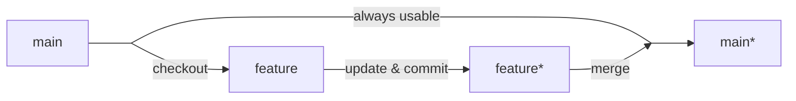
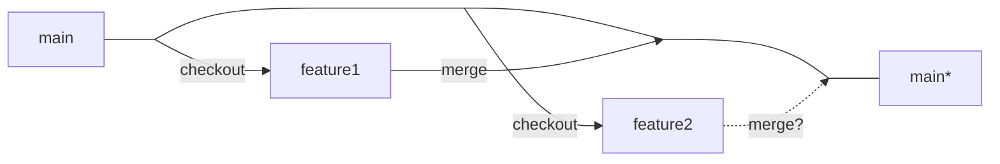
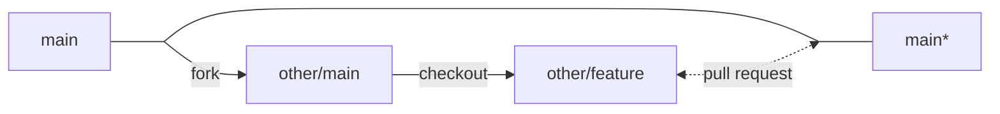

## Why open sourcing?
[Open-source](https://en.wikipedia.org/wiki/Open_source) software is software with source code that anyone can inspect, modify, and enhance. Open source software are incresingly popular for many reasons, having better control, easier to train programmers, **better data security**, stability and **collaborative community**.


### Tools

|  | Documentation | Version control | Unit tests | Release | Collaboration |
| --- | --- | --- | --- | --- | --- |
| **Old days** | txt file contained in a zip/iso | an office process that recorded the work and managed the versioning task | capture and replay testing tools | CD-ROM | in an office |
| **Modern** | [Markdown](https://www.markdownguide.org/basic-syntax/) ([tutorial](https://www.markdowntutorial.com/)) + [GitHub Pages](https://pages.github.com/) | [Git](https://www.atlassian.com/git) | [unit test](https://en.wikipedia.org/wiki/Unit_testing) + [continuous integration](https://en.wikipedia.org/wiki/CI/CD) (with test coverage report) built on top of cloud machines | [GitHub](https://github.com/) | GitHub/[GitLab](https://gitlab.com/) |

### AMAT5315 open source stack
- programming
  - Editor: the [VSCode](https://www.julia-vscode.org/) editor as the IDE to program in Julia.
- compiling:
  - Compiler: the [Julia](https://julialang.org/) programming language and its compiler.
- tests
  - Unit test: the [Test](https://docs.julialang.org/en/v1/stdlib/Test/) module in Julia.
- Version control: the [Git](https://git-scm.com/) as the version control software and the [GitHub](https://github.com/) website as the place to store your code. Our homework will be submitted through a [locally deployed GitLab](https://code.hkust-gz.edu.cn/).

Except the GitHub website, all the above tools are open-source.

### Access a Linux cloud machine through SSH
[SSH](https://en.wikipedia.org/wiki/Secure_Shell) is a cryptographic network protocol for operating network services securely over an unsecured network. Its most notable applications are remote login and command-line execution.
To learn more about SSH and two factor authentication, please check [this lecture](https://missing.csail.mit.edu/2020/security/).

With a host name (the IP of the target machine to login) and a user name, one can use the following command to login,
```bash
ssh <username>@<hostname>
```
You will get logged in after inputting the password.


### Platform specific installation guide
- **Windows**: [How to install Linux on Windows with WSL](https://learn.microsoft.com/en-us/windows/wsl/install).
- **MacOS**: MacOS is a Unix-like operating system, so you can use the built-in terminal to access a Linux shell.
- **From scratch**: [How to install Ubuntu](https://ubuntu.com/tutorials/install-ubuntu-desktop#1-overview).


### Vim Editor
A vim editor can be found in any Linux distribution, with or without a graphical user interface. To edit a file, just type `vim file_name`.

```
i       # input
:w      # write
:q      # quit
:q!     # force quit without saving

u       # undo
CTRL-R  # redo
```
All the commands must be executed in the command mode (the default mode when you start a vim editor),
If you are currently in the input mode, you can always type `ESC` to go back to the command mode. To learn more about Vim, please check the [MIT open course: Missing semester - Editors](https://missing.csail.mit.edu/2020/editors/).


## Version Control: Git

Version control, also known as source control, is the practice of tracking and managing changes to software code. Install `git` with
```bash
sudo apt install git
```

## How does Git work?
### Tier 1: Single branch
- You start with a working directory, then use `git init` to make it a git repository.
- You can use `git add` to add files to the staging area, and use `git commit` to commit the changes to the repository.
- You can use `git checkout` to switch between commits.
- You can use `git diff` to see the changes between commits.
- You can use `git reset` to reset the current HEAD to the specified state.
- You can use `git status` to see the status of the working directory, staging area, and repository.
- You can use `git log` to see the history of commits.

### Tier 2: Multiple branches
- You can use `git branch` to create, list, rename, and delete branches. The source code on the `main` branch is always usable, which serves as the stable version of the software.
- You can use `git merge` to merge branches.
- You can use `git checkout` to switch between branches.
- You can use `git diff` to see the changes between branches.

Example 1: develop a new feature


Example 2: develop two features



Question: what if the two features are not compatible?


### Tier 3: Working with remote repositories
- You can use `git remote add <remote-name> <url>` to add a remote repository.
- You can use `git push <remote-name> <branch>` to push commits to a remote repository.
- You can use `git pull <remote-name> <branch>` to fetch from and integrate with another repo or a local branch.

### Tier 4: Collaborating with others
- You can open an issue on GitHub/[GitLab](https://en.wikipedia.org/wiki/GitLab) to report a bug or request a feature.
- You can create [a pull request](https://docs.github.com/en/pull-requests/collaborating-with-pull-requests/proposing-changes-to-your-work-with-pull-requests/creating-a-pull-request) on GitHub/GitLab to propose changes to a repository and discuss them with others.

Example: collaborate with others



### A cheat sheet for Git and GitHub

There are more than 100 git sub-commands, and the following is a short list to keep in mind.

```
# global config
git config  # Get and set repository or global options

# initialize a repo
git init    # Create an empty Git repo or reinitialize an existing one
git clone   # Clone repository into new directory

# info
git status  # Show the working tree status
git log     # Show commit logs
git diff    # Show changes between commits, commit and working tree, etc

# work on a branch
git add     # Add file contents to the index
git rm      # Remove files from the working tree and from the index
git commit  # Record changes to the repository
git reset   # Reset current HEAD to the specified state

# branch manipulation
git checkout # Switch branches or restore working tree files
git branch  # List, create, or delete branches
git merge   # Join two or more development histories together

# remote synchronization
git remote  # Manage set of tracked repositories
git pull  # Fetch from and integrate with another repo or a local branch
git fetch   # Download objects and refs from another repository
git push    # Update remote refs along with associated objects
```

### More resources
* [Learn Git](https://learngitbranching.js.org/)
* [Github Manual](https://githubtraining.github.io/training-manual/book.pdf)
* [How to create a new github repo](https://docs.github.com/en/get-started/quickstart/create-a-repo)
* [MIT open course: Missing Semester - Version Control](https://missing.csail.mit.edu/2020/version-control/).

## Unit Test
Unit tests are typically [automated tests](https://en.wikipedia.org/wiki/Automated_test) written and run by [software developers](https://en.wikipedia.org/wiki/Software_developer) to ensure that a section of an application (known as the "unit") meets its [design](https://en.wikipedia.org/wiki/Software_design) and behaves as intended.
