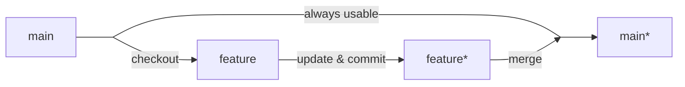
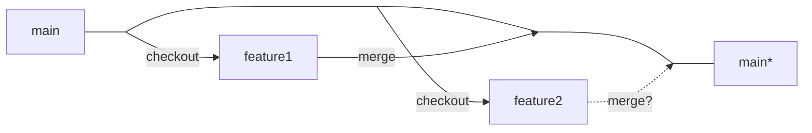
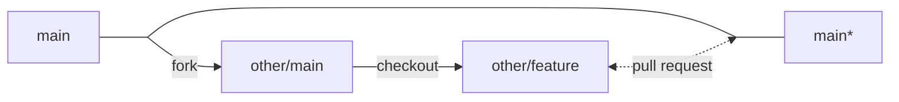

# The open source workflow

Scientific computing is a combination of **scientific applications**, **mathematical modeling** and **high performance computing**. The first lecture focuses on understanding the open source workflow, which is the foundation of scientific computing. It is a summary of the [MIT open course: Missing Semester](https://missing.csail.mit.edu/2020/).

## Why open sourcing?
[Open-source](https://en.wikipedia.org/wiki/Open_source) software is software with source code that anyone can inspect, modify, and enhance. Open source software are incresingly popular for many reasons, having better control, easier to train programmers, **better data security**, stability and **collaborative community**.

### Case study: Doc and Docx

[Reading: What Is a .DOCX File, and How Is It Different from a .DOC File in Microsoft Word?](https://www.howtogeek.com/304622/what-is-a-.docx-file-and-how-is-it-different-from-a-.doc-file-in-microsoft-word/)

> Under pressure from the rising competition of the free and open-source Open Office and its competing Open Document Format (ODF), Microsoft pushed for the adoption of an even broader open standard in the early 2000s. This culminated in the development of the DOCX file format, along with its companions like XLSX for spreadsheets and PPTX for presentations.


In the past, scientific computing was dominated by commercial software, such as Matlab, Mathematica, Maple, and Magma. To maintain a commercial software, the company must hire a large team of programmers and marketing staffs. The cost of maintaining a commercial software is very high.
Nowadays, the open source software, such as Python, Julia, R, and SageMath, are becoming more and more popular in scientific computing. The open source scientific software can be maintained by a small group of scientists, benefiting from the **mature open source software stack**.

### Open source campaign and Linux

Just like Windows, IOS, and Mac OS, Linux is an operating system. In fact, one of the most popular platforms on the planet, Android, is powered by the Linux operating system.
It is free to use, [open source](https://opensource.com/resources/what-open-source), widely used on clusters and good at automating your works.
Linux kernel, Linux operating system and Linux distribution are different concepts.
 A **Linux distribution** is an [operating system](https://en.wikipedia.org/wiki/Operating_system) made from a software collection that includes the [Linux kernel](https://en.wikipedia.org/wiki/Linux_kernel) and, often, a [package management system](https://en.wikipedia.org/wiki/Package_management_system)
 
- 1991, by [Linus Torvalds](https://en.wikipedia.org/wiki/Linus_Torvalds)
- Linux is typically [packaged](https://en.wikipedia.org/wiki/Package_manager) as a [Linux distribution](https://en.wikipedia.org/wiki/Linux_distribution)
- GNU's Not Unix! (GNU) (1983 by Richard Stallman)
    
    Its goal is to give computer users freedom and control in their use of their computers and [computing devices](https://en.wikipedia.org/wiki/Computer_hardware) by collaboratively developing and publishing software that gives everyone the rights to freely run the software, copy and distribute it, study it, and modify it. GNU software grants these rights in its [license](https://en.wikipedia.org/wiki/GNU_General_Public_License).
    
    
    
- The problem of GPL Lisense: The GPL and licenses modeled on it impose the restriction that source code must be distributed or made available for all works that are derivatives of the GNU copyrighted code.
    
    Case study: [Free Software fundation v.s. Cisco Systems](https://www.notion.so/Wiki-53dd9dafd57b40f6b253d6605667a472)
    
    Modern Licenses are: [MIT](https://en.wikipedia.org/wiki/MIT_License) and [Apache](https://en.wikipedia.org/wiki/Apache_License).


## The open source workflow


### Tools

|  | Documentation | Version control | Unit tests | Release | Collaboration |
| --- | --- | --- | --- | --- | --- |
| **Old days** | txt file contained in a zip/iso | an office process that recorded the work and managed the versioning task | capture and replay testing tools | CD-ROM | in an office |
| **Modern** | [Markdown](https://www.markdownguide.org/basic-syntax/) ([tutorial](https://www.markdowntutorial.com/)) + [GitHub Pages](https://pages.github.com/) | [Git](https://www.atlassian.com/git) | [unit test](https://en.wikipedia.org/wiki/Unit_testing) + [continuous integration](https://en.wikipedia.org/wiki/CI/CD) (with test coverage report) built on top of cloud machines | [GitHub](https://github.com/) | GitHub/[GitLab](https://gitlab.com/) |

### AMAT5315 open source stack
- programming
  - Operating system: the [Ubuntu](https://ubuntu.com/desktop) distribution of the [Linux](https://en.wikipedia.org/wiki/Linux) operating system.
  - Editor: the [VSCode](https://www.julia-vscode.org/) editor as the IDE to program in Julia.
- compiling:
  - Compiler: the [Julia](https://julialang.org/) programming language and its compiler.
- tests
  - Unit test: the [Test](https://docs.julialang.org/en/v1/stdlib/Test/) module in Julia.
- Version control: the [Git](https://git-scm.com/) as the version control software and the [GitHub](https://github.com/) website as the place to store your code. Our homework will be submitted through a [locally deployed GitLab](https://code.hkust-gz.edu.cn/).

Except the GitHub website, all the above tools are open-source.

## Linux operating system
Just like Windows, iOS, and Mac OS, Linux is an operating system. In fact, one of the most popular platforms on the planet, Android, is powered by the Linux operating system.
It is free to use, [open source](https://opensource.com/resources/what-open-source), widely used on clusters and good at automating your works.
The Ubuntu system is one of the most popular [Linux distributions](https://en.wikipedia.org/wiki/Linux_distribution).

### Why a scientific computing scientist must learn Linux?
Citing [linux statistics](https://truelist.co/blog/linux-statistics/),
- 47% of professional developers use Linux-based operating systems. (Statista)
- Linux powers 39.2% of websites whose operating system is known. (W3Techs)
- Linux powers 85% of smartphones. (Hayden James)
- Linux, the third most popular desktop OS, has a market share of 2.09%. (Statista)
- The Linux market size worldwide will reach \$15.64 billion by 2027. (Fortune Business Insights)
- The world’s top 500 fastest supercomputers all run on Linux. (Blackdown)
- 96.3% of the top one million web servers are running Linux. (ZDNet)
- Today, there are over 600 active Linux distros. (Tecmint)
- Linux runs 90 percent of the public cloud workload

### Access a Linux cloud machine through SSH
[SSH](https://en.wikipedia.org/wiki/Secure_Shell) is a cryptographic network protocol for operating network services securely over an unsecured network. Its most notable applications are remote login and command-line execution.
To learn more about SSH and two factor authentication, please check [this lecture](https://missing.csail.mit.edu/2020/security/).

With a host name (the IP of the target machine to login) and a user name, one can use the following command to login,
```bash
ssh <username>@<hostname>
```
You will get logged in after inputting the password.


### Platform specific installation guide
- **Windows**: [How to install Linux on Windows with WSL](https://learn.microsoft.com/en-us/windows/wsl/install).
- **MacOS**: MacOS is a Unix-like operating system, so you can use the built-in terminal to access a Linux shell.
- **From scratch**: [How to install Ubuntu](https://ubuntu.com/tutorials/install-ubuntu-desktop#1-overview).

### A cheatsheet for Bash scripting
Bash is a Unix shell and command language written by Brian Fox for the GNU Project. In Ubuntu, one can use `Ctrl` + `Alt` + `T` to open a bash shell. In a bash shell, we use `man command_name` to get help information related to a command, use `CTRL-C` to break a program and `CTRL-D` to exit a shell or an REPL.

The bash grammar is well summarized in [this cheatsheet](https://devhints.io/bash). The following is a short list for commands that will be used in this course.

```
man     # an interface to the system reference manuals

ls      # list directory contents
cd      # change directory
mkdir   # make directories
rm      # remove files or directories
pwd     # print name of current/working directory

echo    # display a line of text
cat     # concatenate files and print on the standard output

alias   # create an alias for a command

lscpu   # display information about the CPU architecture
lsmem   # list the ranges of available memory with their online status

top     # display Linux processes
ssh     # the OpenSSH remote login client
vim     # Vi IMproved, a programmer's text editor
git     # the stupid content tracker

useradd # create a new user or update default new user information
passwd  # change user password

tar     # an archiving utility
```

A more detailed [cheat sheet](https://cheatography.com/davechild/cheat-sheets/linux-command-line/) and a [lecture](https://missing.csail.mit.edu/2020/shell-tools/) are available online. The website [Learn Bash Shell](https://www.learnshell.org/) is also a good place to start.


### Vim Editor
A vim editor can be found in any Linux distribution, with or without a graphical user interface. To edit a file, just type `vim file_name`.

```
i       # input
:w      # write
:q      # quit
:q!     # force quit without saving

u       # undo
CTRL-R  # redo
```
All the commands must be executed in the command mode (the default mode when you start a vim editor),
If you are currently in the input mode, you can always type `ESC` to go back to the command mode. To learn more about Vim, please check the [MIT open course: Missing semester - Editors](https://missing.csail.mit.edu/2020/editors/).


## Version Control: Git

Version control, also known as source control, is the practice of tracking and managing changes to software code. Install `git` with
```bash
sudo apt install git
```

## How does Git work?
### Tier 1: Single branch
- You start with a working directory, then use `git init` to make it a git repository.
- You can use `git add` to add files to the staging area, and use `git commit` to commit the changes to the repository.
- You can use `git checkout` to switch between commits.
- You can use `git diff` to see the changes between commits.
- You can use `git reset` to reset the current HEAD to the specified state.
- You can use `git status` to see the status of the working directory, staging area, and repository.
- You can use `git log` to see the history of commits.

### Tier 2: Multiple branches
- You can use `git branch` to create, list, rename, and delete branches. The source code on the `main` branch is always usable, which serves as the stable version of the software.
- You can use `git merge` to merge branches.
- You can use `git checkout` to switch between branches.
- You can use `git diff` to see the changes between branches.

Example 1: develop a new feature


Example 2: develop two features



Question: what if the two features are not compatible?


### Tier 3: Working with remote repositories
- You can use `git remote add <remote-name> <url>` to add a remote repository.
- You can use `git push <remote-name> <branch>` to push commits to a remote repository.
- You can use `git pull <remote-name> <branch>` to fetch from and integrate with another repo or a local branch.

### Tier 4: Collaborating with others
- You can open an issue on GitHub/[GitLab](https://en.wikipedia.org/wiki/GitLab) to report a bug or request a feature.
- You can create [a pull request](https://docs.github.com/en/pull-requests/collaborating-with-pull-requests/proposing-changes-to-your-work-with-pull-requests/creating-a-pull-request) on GitHub/GitLab to propose changes to a repository and discuss them with others.

Example: collaborate with others



### A cheat sheet for Git and GitHub

There are more than 100 git sub-commands, and the following is a short list to keep in mind.

```
# global config
git config  # Get and set repository or global options

# initialize a repo
git init    # Create an empty Git repo or reinitialize an existing one
git clone   # Clone repository into new directory

# info
git status  # Show the working tree status
git log     # Show commit logs
git diff    # Show changes between commits, commit and working tree, etc

# work on a branch
git add     # Add file contents to the index
git rm      # Remove files from the working tree and from the index
git commit  # Record changes to the repository
git reset   # Reset current HEAD to the specified state

# branch manipulation
git checkout # Switch branches or restore working tree files
git branch  # List, create, or delete branches
git merge   # Join two or more development histories together

# remote synchronization
git remote  # Manage set of tracked repositories
git pull  # Fetch from and integrate with another repo or a local branch
git fetch   # Download objects and refs from another repository
git push    # Update remote refs along with associated objects
```

### More resources
* [Learn Git](https://learngitbranching.js.org/)
* [Github Manual](https://githubtraining.github.io/training-manual/book.pdf)
* [How to create a new github repo](https://docs.github.com/en/get-started/quickstart/create-a-repo)
* [MIT open course: Missing Semester - Version Control](https://missing.csail.mit.edu/2020/version-control/).

## Unit Test
Unit tests are typically [automated tests](https://en.wikipedia.org/wiki/Automated_test) written and run by [software developers](https://en.wikipedia.org/wiki/Software_developer) to ensure that a section of an application (known as the "unit") meets its [design](https://en.wikipedia.org/wiki/Software_design) and behaves as intended.