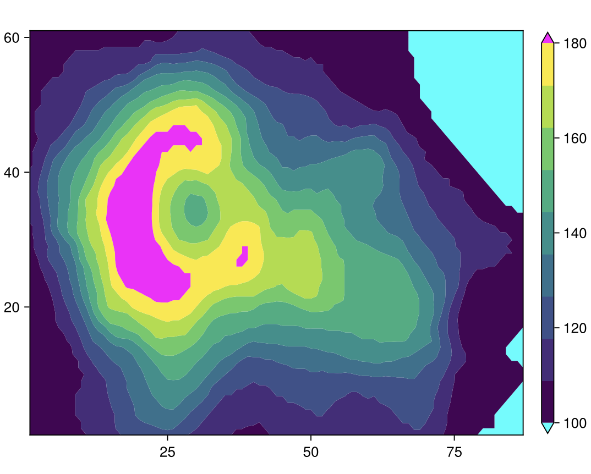

# Plotting tutorial

In this section, we have prepared a set of plotting scripts and simple tutorials to show how to generate different type of pictures.

## Importing 
First, we should import Makie and CairoMakie.

```julia
julia> using Pkg
julia> Pkg.add("Makie")
julia> Pkg.add("CairoMakie")
```

```julia
julia> using Makie, CairoMakie
```
- **Figure**: This is the top-level container for all the elements of your visualization. It can contain multiple plots, as well as other elements like legends, colorbars, etc.

- **Axis**: This is the actual plot, where your data is visualized. An axis can contain multiple graphical elements, like lines, scatter points, surfaces, etc. It also contains the x-axis and y-axis, which have scales (linear, logarithmic, etc.) and ticks. 
- **Plots**: These are the graphical representations of your data. In Makie.jl, create a plot by adding graphical elements (like lines, scatter points, etc.) to an axis. Each type of plot is suited to represent a certain kind of data.

In the next steps, we will take a look at how we can create these objects.


## Adding Line Plots to an Axis and setting the title and labels
These Julia code snippets demonstrate how to create line and scatter plots with the CairoMakie library, including setting titles, labels, and legends.

```julia
using CairoMakie
x = range(0, 10, length=100)
fig = Figure()
ax = Axis(fig[1, 1], title = "Line Plots", xlabel = "X", ylabel = "Y") # Create an axis with title and labels
lines!(ax, x, sin.(x), color = :red, label = "sin") # Create a line plot, set color and label
lines!(ax, x, cos.(x), color = :blue, label = "cos") # Add another line plot to the same axis
axislegend(ax; position = :rb, labelsize = 15)
fig
save("plot_lines6.png", fig)
```


    


## Adding a Scatter Plot to an Axis and setting the title and labels
```julia
using CairoMakie
x = range(0, 10, length=100)
fig = Figure()
ax = Axis(fig[1, 1], title = "Scatter Plots", xlabel = "X", ylabel = "Y")
scatter!(ax, x, sin.(x), color = :red, markersize = 5, label = "sin") # Create a scatter plot, set color, markersize and label
scatter!(ax, x, cos.(x), color = :blue, markersize = 10, label = "cos") # Add another scatter plot to the same axis
axislegend(ax; position = :rb, labelsize = 15)
fig
```


## Create Subplots
This Julia code demonstrates how to create multiple subplots using the CairoMakie library. Three axes are created, each with a title and labels, and a sine function is plotted on each axis with different colors. The lines! function is used to add the line plots to the axes. The resulting figure contains three subplots arranged in a grid.
```julia
using CairoMakie
x = LinRange(0, 10, 100)
y = sin.(x)
fig = Figure()
ax1 = Axis(fig[1, 1], title = "Red Sin Plot", xlabel = "X", ylabel = "Y") # Create an axis with title and labels
lines!(ax1, x, y, color = :red, label = "sin")
ax2 = Axis(fig[1, 2], title = "Blue Sin Plot", xlabel = "X", ylabel = "Y")
lines!(ax2, x, y, color = :blue, label = "sin")
ax3 = Axis(fig[2, 1:2], title = "Green Sin Plot", xlabel = "X", ylabel = "Y") 
lines!(ax3, x, y, color = :green, label = "sin")

fig
```


## Heatmap 
This Julia code shows how to create a heatmap using the CairoMakie library. An axis is created with a title and labels, then a heatmap is added to the axis using the heatmap! function with randomly generated data. A colorbar is also added to the right of the heatmap for reference.
```julia
using CairoMakie
fig = Figure()
ax = Axis(fig[1, 1], title = "Heatmap", xlabel = "X", ylabel = "Y") # Create an axis with title and labels
hm = heatmap!(ax, randn(20, 20)) # Create a random heatmap
Colorbar(fig[1, 2], hm, label = "Color scale") # Add a colorbar to the right of the heatmap
fig
```


```julia
using CairoMakie


function mandelbrot(x, y)
    z = c = x + y*im
    for i in 1:30.0; abs(z) > 2 && return i; z = z^2 + c; end; 0
end

heatmap(-2:0.001:1, -1.1:0.001:1.1, mandelbrot,
    colormap = Reverse(:deep))
```


## Contour Plot
### Examples
```julia
using CairoMakie


f = Figure()
Axis(f[1, 1])

xs = LinRange(0, 10, 100)
ys = LinRange(0, 15, 100)
zs = [cos(x) * sin(y) for x in xs, y in ys]

contour!(zs,levels=-1:0.1:1)

f
```


```julia
using CairoMakie


himmelblau(x, y) = (x^2 + y - 11)^2 + (x + y^2 - 7)^2
x = y = range(-6, 6; length=100)
z = himmelblau.(x, y')

levels = 10.0.^range(0.3, 3.5; length=10)
colorscale = ReversibleScale(x -> x^(1 / 10), x -> x^10)
f, ax, ct = contour(x, y, z; labels=true, levels, colormap=:hsv, colorscale)
f
```


```julia
using CairoMakie
using DelimitedFiles


volcano = readdlm(Makie.assetpath("volcano.csv"), ',', Float64)

f = Figure()
ax = Axis(f[1, 1])

co = contourf!(volcano,
    levels = range(100, 180, length = 10),
    extendlow = :cyan, extendhigh = :magenta)

tightlimits!(ax)

Colorbar(f[1, 2], co)

f
```



### 3D Contour Plot
```julia
using CairoMakie


f = Figure()
Axis3(f[1, 1], aspect=(0.5,0.5,1), perspectiveness=0.75)

xs = ys = LinRange(-0.5, 0.5, 100)
zs = [sqrt(x^2+y^2) for x in xs, y in ys]

contour3d!(-zs, levels=-(.025:0.05:.475), linewidth=2, color=:blue2)
contour3d!(+zs, levels=  .025:0.05:.475,  linewidth=2, color=:red2)

f
```


## Colorbar of heatmap/contour Examples   
This Julia code snippet demonstrates how to create heatmaps and contour plots with colorbars using the CairoMakie library. It first defines a range of x and y values and calculates a corresponding z value for each (x, y) pair. It then creates four subplots: two heatmaps and two contour plots, each with different color maps and level settings. A colorbar is added to each subplot for reference. The `heatmap`, `contourf`, and `Colorbar` functions are used to create the plots and colorbars.
```julia
using CairoMakie

xs = LinRange(0, 20, 50)
ys = LinRange(0, 15, 50)
zs = [cos(x) * sin(y) for x in xs, y in ys]

fig = Figure()

ax, hm = heatmap(fig[1, 1][1, 1], xs, ys, zs)
Colorbar(fig[1, 1][1, 2], hm)

ax, hm = heatmap(fig[1, 2][1, 1], xs, ys, zs, colormap = :grays,
    colorrange = (-0.75, 0.75), highclip = :red, lowclip = :blue)
Colorbar(fig[1, 2][1, 2], hm)

ax, hm = contourf(fig[2, 1][1, 1], xs, ys, zs,
    levels = -1:0.25:1, colormap = :heat)
Colorbar(fig[2, 1][1, 2], hm, ticks = -1:0.25:1)

ax, hm = contourf(fig[2, 2][1, 1], xs, ys, zs,
    colormap = :Spectral, levels = [-1, -0.5, -0.25, 0, 0.25, 0.5, 1])
Colorbar(fig[2, 2][1, 2], hm, ticks = -1:0.25:1)

fig
```


## Arrows examples
We will introduce how to create 2D and 3D arrows using the CairoMakie library. The arrows are visualized on a grid with different colors and sizes to represent the strength of the vector field.

### 2D Arrows
```julia
using CairoMakie

f = Figure(size = (800, 800))
Axis(f[1, 1], backgroundcolor = "black")

xs = LinRange(0, 2pi, 20)
ys = LinRange(0, 3pi, 20)
us = [sin(x) * cos(y) for x in xs, y in ys]
vs = [-cos(x) * sin(y) for x in xs, y in ys]
strength = vec(sqrt.(us .^ 2 .+ vs .^ 2))

arrows!(xs, ys, us, vs, arrowsize = 10, lengthscale = 0.3,
    arrowcolor = strength, linecolor = strength)

f
```


### 3D Plotting


```julia
using GLMakie

using LinearAlgebra

ps = [Point3f(x, y, z) for x in -5:2:5 for y in -5:2:5 for z in -5:2:5]
ns = map(p -> 0.1 * Vec3f(p[2], p[3], p[1]), ps)
lengths = norm.(ns)
arrows(
    ps, ns, fxaa=true, # turn on anti-aliasing
    color=lengths,
    linewidth = 0.1, arrowsize = Vec3f(0.3, 0.3, 0.4),
    align = :center, axis=(type=Axis3,)
)
```


## Bracket
### Examples
```julia
using CairoMakie

f, ax, l = lines(0..9, sin; axis = (; xgridvisible = false, ygridvisible = false))
ylims!(ax, -1.5, 1.5)

bracket!(pi/2, 1, 5pi/2, 1, offset = 5, text = "Period length", style = :square)

bracket!(pi/2, 1, pi/2, -1, text = "Amplitude", orientation = :down,
    linestyle = :dash, rotation = 0, align = (:right, :center), textoffset = 4, linewidth = 2, color = :red, textcolor = :red)

bracket!(2.3, sin(2.3), 4.0, sin(4.0),
    text = "Falling", offset = 10, orientation = :up, color = :purple, textcolor = :purple)

bracket!(Point(5.5, sin(5.5)), Point(7.0, sin(7.0)),
    text = "Rising", offset = 10, orientation = :down, color = :orange, textcolor = :orange, 
    fontsize = 30, textoffset = 30, width = 50)
f
```


```julia
using CairoMakie

f = Figure()
ax = Axis(f[1, 1])

bracket!(ax,
    1:5,
    2:6,
    3:7,
    2:6,
    text = ["A", "B", "C", "D", "E"],
    orientation = :down,
)

bracket!(ax,
    [(Point2f(i, i-0.7), Point2f(i+2, i-0.7)) for i in 1:5],
    text = ["F", "G", "H", "I", "J"],
    color = [:red, :blue, :green, :orange, :brown],
    linestyle = [:dash, :dot, :dash, :dot, :dash],
    orientation = [:up, :down, :up, :down, :up],
    textcolor = [:red, :blue, :green, :orange, :brown],
    fontsize = range(12, 24, length = 5),
)

f
```


## Error Bars
### Examples
```julia
using CairoMakie


f = Figure()
Axis(f[1, 1])

xs = 0:0.5:10
ys = 0.5 .* sin.(xs)

lowerrors = fill(0.1, length(xs))
higherrors = LinRange(0.1, 0.4, length(xs))

errorbars!(xs, ys, lowerrors, higherrors,
    color = range(0, 1, length = length(xs)),
    whiskerwidth = 10)

# plot position scatters so low and high errors can be discriminated
scatter!(xs, ys, markersize = 3, color = :black)

f
```


## Streamplot
### Examples
```julia
using CairoMakie


struct FitzhughNagumo{T}
    ϵ::T
    s::T
    γ::T
    β::T
end

P = FitzhughNagumo(0.1, 0.0, 1.5, 0.8)

f(x, P::FitzhughNagumo) = Point2f(
    (x[1]-x[2]-x[1]^3+P.s)/P.ϵ,
    P.γ*x[1]-x[2] + P.β
)

f(x) = f(x, P)

fig, ax, pl = streamplot(f, -1.5..1.5, -1.5..1.5, colormap = :magma)
# you can also pass a function to `color`, to either return a number or color value
streamplot(fig[1,2], f, -1.5 .. 1.5, -1.5 .. 1.5, color=(p)-> RGBAf(p..., 0.0, 1))
fig
```


## Text
### Examples
```julia
using CairoMakie


f = Figure()
ax = Axis(f[1, 1])

lines!(0..10, x -> sin(3x) / (cos(x) + 2),
    label = L"\frac{\sin(3x)}{\cos(x) + 2}")
lines!(0..10, x -> sin(x^2) / (cos(sqrt(x)) + 2),
    label = L"\frac{\sin(x^2)}{\cos(\sqrt{x}) + 2}")

Legend(f[1, 2], ax)

f
```


```julia


