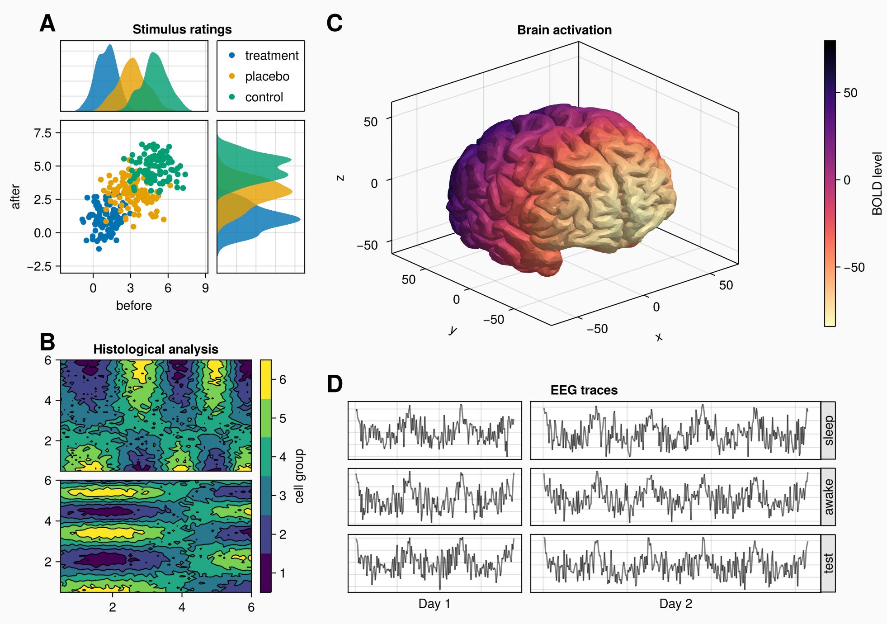
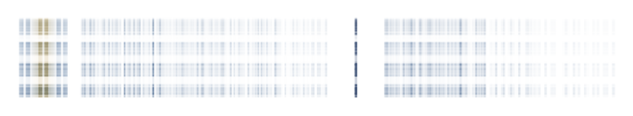
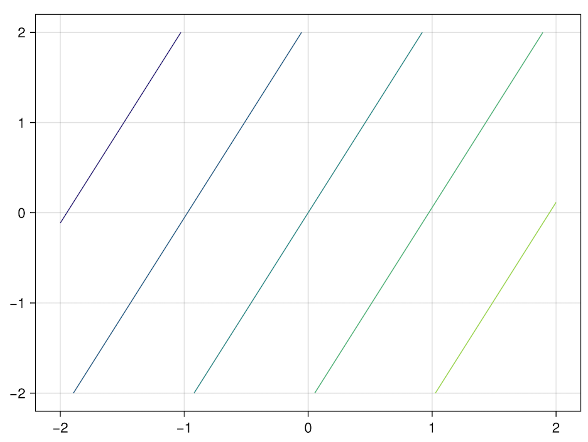
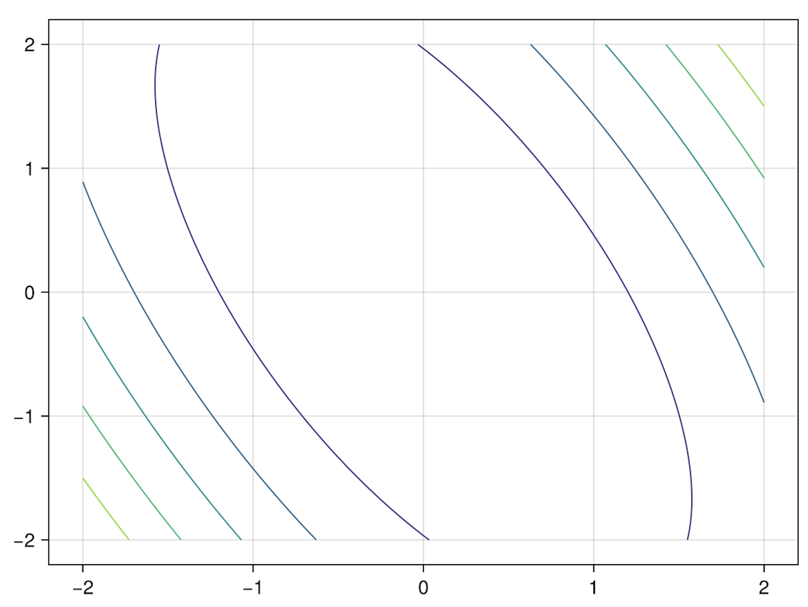
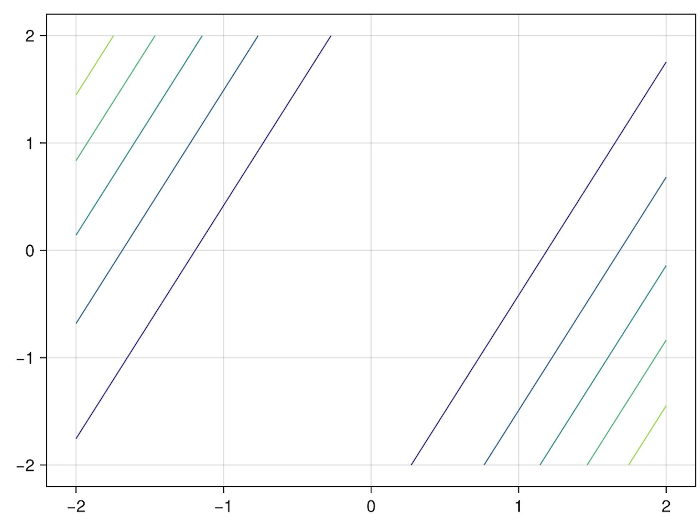
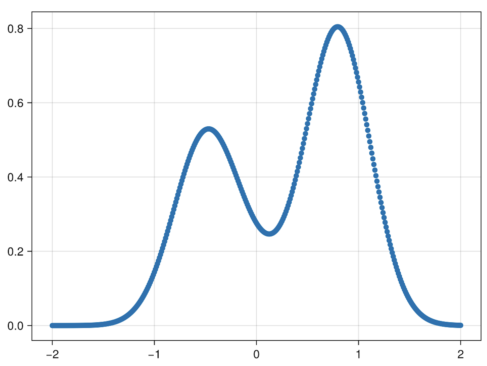
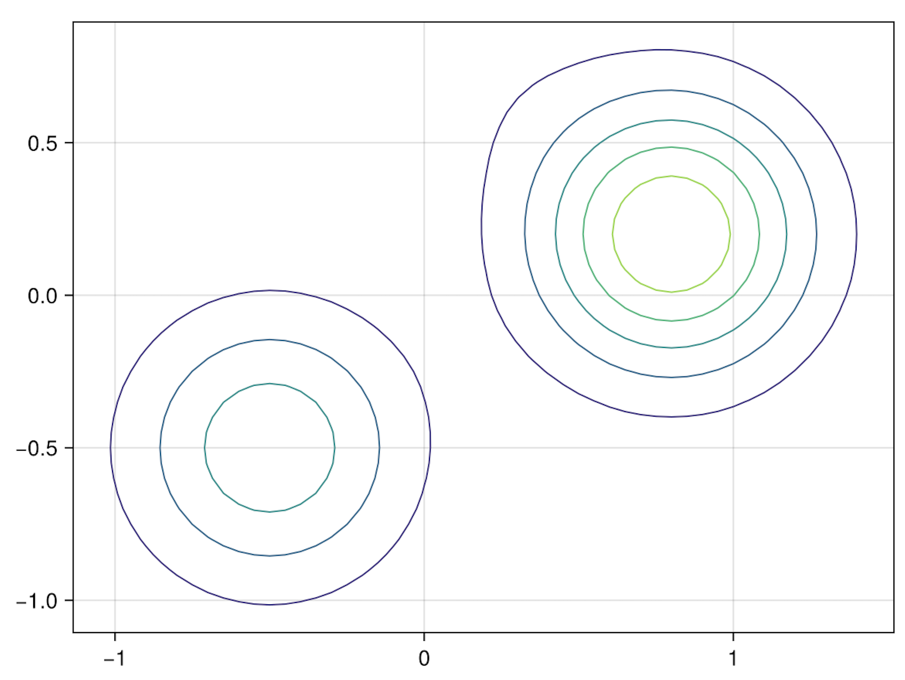

# Plotting tutorial

In this section, we have prepared a set of plotting scripts and simple tutorials to show how to generate different type of pictures.

## Importing 
First, we should import Makie and CairoMakie.

```julia
julia> using Pkg
julia> Pkg.add("Makie")
julia> Pkg.add("CairoMakie")
```

```julia
julia> using Makie, CairoMakie
```
- **Figure**: This is the top-level container for all the elements of your visualization. It can contain multiple plots, as well as other elements like legends, colorbars, etc.

- **Axis**: This is the actual plot, where your data is visualized. An axis can contain multiple graphical elements, like lines, scatter points, surfaces, etc. It also contains the x-axis and y-axis, which have scales (linear, logarithmic, etc.) and ticks. 
- **Plots**: These are the graphical representations of your data. In Makie.jl, create a plot by adding graphical elements (like lines, scatter points, etc.) to an axis. Each type of plot is suited to represent a certain kind of data.

In the next steps, we will take a look at how we can create these objects.


## Adding Line Plots to an Axis and setting the title and labels
```julia
using CairoMakie
x = range(0, 10, length=100)
fig = Figure()
ax = Axis(fig[1, 1], title = "Line Plots", xlabel = "X", ylabel = "Y") # Create an axis with title and labels
lines!(ax, x, sin.(x), color = :red, label = "sin") # Create a line plot, set color and label
lines!(ax, x, cos.(x), color = :blue, label = "cos") # Add another line plot to the same axis
axislegend(ax; position = :rb, labelsize = 15)
fig
save("plot_lines6.png", fig)
```


    


## Adding a Scatter Plot to an Axis and setting the title and labels
```julia
using CairoMakie
x = range(0, 10, length=100)
fig = Figure()
ax = Axis(fig[1, 1], title = "Scatter Plots", xlabel = "X", ylabel = "Y")
scatter!(ax, x, sin.(x), color = :red, markersize = 5, label = "sin") # Create a scatter plot, set color, markersize and label
scatter!(ax, x, cos.(x), color = :blue, markersize = 10, label = "cos") # Add another scatter plot to the same axis
axislegend(ax; position = :rb, labelsize = 15)
fig
```


## Create Subplots
```julia
using CairoMakie
x = LinRange(0, 10, 100)
y = sin.(x)
fig = Figure()
ax1 = Axis(fig[1, 1], title = "Red Sin Plot", xlabel = "X", ylabel = "Y") # Create an axis with title and labels
lines!(ax1, x, y, color = :red, label = "sin")
ax2 = Axis(fig[1, 2], title = "Blue Sin Plot", xlabel = "X", ylabel = "Y")
lines!(ax2, x, y, color = :blue, label = "sin")
ax3 = Axis(fig[2, 1:2], title = "Green Sin Plot", xlabel = "X", ylabel = "Y") 
lines!(ax3, x, y, color = :green, label = "sin")

fig
```


## Create Heatmap 
```julia
using CairoMakie
fig = Figure()
ax = Axis(fig[1, 1], title = "Heatmap", xlabel = "X", ylabel = "Y") # Create an axis with title and labels
hm = heatmap!(ax, randn(20, 20)) # Create a random heatmap
Colorbar(fig[1, 2], hm, label = "Color scale") # Add a colorbar to the right of the heatmap
fig
```


## Colorbar Examples   
```julia
using CairoMakie

xs = LinRange(0, 20, 50)
ys = LinRange(0, 15, 50)
zs = [cos(x) * sin(y) for x in xs, y in ys]

fig = Figure()

ax, hm = heatmap(fig[1, 1][1, 1], xs, ys, zs)
Colorbar(fig[1, 1][1, 2], hm)

ax, hm = heatmap(fig[1, 2][1, 1], xs, ys, zs, colormap = :grays,
    colorrange = (-0.75, 0.75), highclip = :red, lowclip = :blue)
Colorbar(fig[1, 2][1, 2], hm)

ax, hm = contourf(fig[2, 1][1, 1], xs, ys, zs,
    levels = -1:0.25:1, colormap = :heat)
Colorbar(fig[2, 1][1, 2], hm, ticks = -1:0.25:1)

ax, hm = contourf(fig[2, 2][1, 1], xs, ys, zs,
    colormap = :Spectral, levels = [-1, -0.5, -0.25, 0, 0.25, 0.5, 1])
Colorbar(fig[2, 2][1, 2], hm, ticks = -1:0.25:1)

fig
```


## Useful Layout example
In this part, you will learn how to create a complex figure using Makie's layout tools by following this example.
```julia
using CairoMakie
using Makie.FileIO
# create the figure first with a gray backgroundcolor, and a predefined font
f = Figure(backgroundcolor = RGBf(0.98, 0.98, 0.98),
    size = (1000, 700)) 
# make the four nested GridLayouts that are going to hold the objects of A, B, C and D. 
ga = f[1, 1] = GridLayout() 
gb = f[2, 1] = GridLayout()
gcd = f[1:2, 2] = GridLayout()
gc = gcd[1, 1] = GridLayout()
gd = gcd[2, 1] = GridLayout()
# There are three axes and a legend. We can place the axes first, link them appropriately, and plot the first data into them.
axtop = Axis(ga[1, 1])
axmain = Axis(ga[2, 1], xlabel = "before", ylabel = "after")
axright = Axis(ga[2, 2])

linkyaxes!(axmain, axright)
linkxaxes!(axmain, axtop)

labels = ["treatment", "placebo", "control"]
data = randn(3, 100, 2) .+ [1, 3, 5]

for (label, col) in zip(labels, eachslice(data, dims = 1))
    scatter!(axmain, col, label = label)
    density!(axtop, col[:, 1])
    density!(axright, col[:, 2], direction = :y)
end
# There's a small gap between the density plots and their axes, which we can remove by fixing one side of the limits.
ylims!(axtop, low = 0)
xlims!(axright, low = 0)
# choose different x ticks with whole numbers
axmain.xticks = 0:3:9
axtop.xticks = 0:3:9
# Set the `label` attribute in the scatter call so it's easier to construct the legend. We can just pass `axmain` as the second argument to `Legend`.
leg = Legend(ga[1, 2], axmain)

hidedecorations!(axtop, grid = false)
hidedecorations!(axright, grid = false)
leg.tellheight = true
# we reduce column and row gaps to make the layout more compact
colgap!(ga, 10)
rowgap!(ga, 10)
# make a title by placing a label across the top two elements.
Label(ga[1, 1:2, Top()], "Stimulus ratings", valign = :bottom,
    font = :bold,
    padding = (0, 0, 5, 0))
# We have two axes stacked on top of each other, and a colorbar alongside them. This time, we create the axes by just plotting into the right GridLayout slots. 
xs = LinRange(0.5, 6, 50)
ys = LinRange(0.5, 6, 50)
data1 = [sin(x^1.5) * cos(y^0.5) for x in xs, y in ys] .+ 0.1 .* randn.()
data2 = [sin(x^0.8) * cos(y^1.5) for x in xs, y in ys] .+ 0.1 .* randn.()

ax1, hm = contourf(gb[1, 1], xs, ys, data1,
    levels = 6)
ax1.title = "Histological analysis"
contour!(ax1, xs, ys, data1, levels = 5, color = :black)
hidexdecorations!(ax1)

ax2, hm2 = contourf(gb[2, 1], xs, ys, data2,
    levels = 6)
contour!(ax2, xs, ys, data2, levels = 5, color = :black)
# how many levels there are, we can make a colorbar using one of the contour plots and then label the bins in there from one to six.
cb = Colorbar(gb[1:2, 2], hm, label = "cell group")
low, high = extrema(data1)
edges = range(low, high, length = 7)
centers = (edges[1:6] .+ edges[2:7]) .* 0.5
cb.ticks = (centers, string.(1:6))
# pull the colorbar labels into its layout cell using the Mixed alignmode. The keyword right = 0 means that the right side of the colorbar should pull its protrusion content inward with an additional padding of 0.
cb.alignmode = Mixed(right = 0)

colgap!(gb, 10)
rowgap!(gb, 10)
# This is just an Axis3 with a colorbar on the side.
brain = load(assetpath("brain.stl"))

ax3d = Axis3(gc[1, 1], title = "Brain activation")
m = mesh!(
    ax3d,
    brain,
    color = [tri[1][2] for tri in brain for i in 1:3],
    colormap = Reverse(:magma),
)
Colorbar(gc[1, 2], m, label = "BOLD level")
# D has a grid of 3x2 axes.
axs = [Axis(gd[row, col]) for row in 1:3, col in 1:2]
hidedecorations!.(axs, grid = false, label = false)

for row in 1:3, col in 1:2
    xrange = col == 1 ? (0:0.1:6pi) : (0:0.1:10pi)

    eeg = [sum(sin(pi * rand() + k * x) / k for k in 1:10)
        for x in xrange] .+ 0.1 .* randn.()

    lines!(axs[row, col], eeg, color = (:black, 0.5))
end

axs[3, 1].xlabel = "Day 1"
axs[3, 2].xlabel = "Day 2"
# make a little title for the six axes by placing a Label in the top protrusion of row 1 and across both columns.
Label(gd[1, :, Top()], "EEG traces", valign = :bottom,
    font = :bold,
    padding = (0, 0, 5, 0))
# bring the subplots closer together by reducing gap sizes.
rowgap!(gd, 10)
colgap!(gd, 10)
# add three boxes on the side with labels in them. In this case, we just place them in another column to the right.
for (i, label) in enumerate(["sleep", "awake", "test"])
    Box(gd[i, 3], color = :gray90)
    Label(gd[i, 3], label, rotation = pi/2, tellheight = false)
end
# The boxes are in the correct positions, but we still need to remove the column gap.
colgap!(gd, 2, 0)
# Set the column widths to Auto(x) where x is a number proportional to the number of data points of the axis. This way, both will have the same relative scaling.
n_day_1 = length(0:0.1:6pi)
n_day_2 = length(0:0.1:10pi)

colsize!(gd, 1, Auto(n_day_1))
colsize!(gd, 2, Auto(n_day_2))
# add the subplot labels, create Labels in the top left protrusion of these layouts. 
for (label, layout) in zip(["A", "B", "C", "D"], [ga, gb, gc, gd])
    Label(layout[1, 1, TopLeft()], label,
        fontsize = 26,
        font = :bold,
        padding = (0, 5, 5, 0),
        halign = :right)
end
# reduce the column width by setting it to Auto with a number smaller than 1, for example. This gives the column a smaller weight when distributing widths between all columns with Auto sizes.
colsize!(f.layout, 1, Auto(0.5))
# increase the size of the row with the panel C layout a bit so it has more space.
rowsize!(gcd, 1, Auto(1.5))
f
```




## ImageProcessing Examples
**FFT Compression Example**
```julia
using ImageProcessing, ImageProcessing.Images, ImageProcessing.LinearAlgebra

fname = "amat.png"
@info "Running FFT compression example, loaded image: $fname"
img = demo_image(fname)

##### FFT #####
img_k = fft_compress(img, size(img)...)
# the momentum space is sparse!
red_channel = Gray.(real.(img_k.channels[1]) ./ sqrt(length(img)))
fname = "red-momentum_space.png"
Images.save(fname, red_channel)
@info "Converting image to momentum space, red channel saved to: $fname"
Images.save(fname, toimage(RGBA{N0f8}, img_k))
fname = "recovered.png"
@info "Recovered image from momentum space is saved to: $fname"

nx, ny = isqrt(2 * size(img, 1)), isqrt(2 * size(img, 2))
img_k_fft = lower_rank(img_k, nx, ny)
cratio = compression_ratio(img_k_fft)
fname = "fft_compressed.png"
Images.save(fname, toimage(RGBA{N0f8}, img_k_fft))
@info "Compressing to size: $nx x $ny, compression ratio: $cratio, saved to: $fname"
```


**SVD Compression Example**
```julia
using ImageProcessing, ImageProcessing.Images, ImageProcessing.LinearAlgebra
using Makie, CairoMakie

fname = "amat.png"
@info "Loading image: $fname"
img = demo_image(fname)

@info "The loaded image has type: $(typeof(img))"

# the RGBA type is a 4‑tuple of red, green, blue and alpha values, each ranging from 0 to 1.
transparent = RGBA(0/255, 0/255, 0/255, 0/255)
black = RGBA(0/255, 0/255, 0/255, 255/255)
white = RGBA(255/255, 255/255, 255/255, 255/255)
red = RGBA(255/255, 0/255, 0/255, 255/255)
green = RGBA(0/255, 255/255, 0/255, 255/255)
blue = RGBA(0/255, 0/255, 255/255, 255/255)
@info """Colors are defined as:
- transparent: $transparent
- black: $black
- white: $white
- red: $red
- green: $green
- blue: $blue
"""

# get one of the color channel
red_channel = getfield.(img[:, :], :r)
# to visualize as a grayscale image
Gray.(red_channel)
fname = "red_channel.png"
Images.save(fname, Gray.(red_channel))
@info "The red channel is saved to: $fname"

# in Images, the color channels are stored as a 3D array with the first dimension being the color channel.
Gray.(channelview(img)[1, :, :])
Gray.(channelview(img)[2, :, :])
Gray.(channelview(img)[3, :, :])

red_svd = svd(red_channel)
fig, = Makie.lines(red_svd.S)
fname = "red_svd_spectrum.png"
Makie.save(fname, fig)
@info "Singular values of the red channel are stored in file: $fname"

# We can decompose a given image into the three color channels red, green and blue.
# Each channel can be represented as a (m × n)‑matrix with values ranging from 0 to 255.
target_rank = 10
compressed = svd_compress(img, target_rank)
compression_ratio(compressed)
newimage = toimage(RGBA{N0f8}, compressed)
fname = "compressed.png"
Images.save(fname, newimage)
@info """Compressing with SVD:
- target rank is: $target_rank
- the compression ratio is: $(compression_ratio(compressed))
- the compressed image is saved to: $fname
"""

# convert to image
toimage(RGBA{N0f8}, compressed)
compressed_rank1 = lower_rank(compressed, 1)
compression_ratio(compressed_rank1)
newimage1 = toimage(RGBA{N0f8}, compressed_rank1)
fname = "compressed_rank1.png"
Images.save(fname, newimage1)
@info """Lowering the rank to 1:
- the compression ratio is: $(compression_ratio(compressed_rank1))
- the compressed image is saved to: $fname
"""
```





** KernelPCA Example**
```julia
import Makie, CairoMakie
using KernelPCA

################## Linear Kernel ###################
xaxis, yaxis = -2:0.05:2, -2:0.05:2
x2 = [KernelPCA.Point(a, b) for a in xaxis, b in yaxis]
constants = [0.8, 0.1, 0.5]
anchors2 = KernelPCA.Point.([(0.8, 0.2), (0.01, -0.9), (-0.5, -0.5)])
lkf = kernelf(KernelPCA.LinearKernel(), constants, anchors2)
Makie.contour(xaxis, yaxis, lkf.(x2); label="2D function")


# linear kernel can always be reduced to single component
constants_simplified = [1.0]
anchors_simplified = [[0.8, 0.1, 0.5]' * KernelPCA.Point.([(0.8, 0.2), (0.01, -0.9), (-0.5, -0.5)])]
lkf = kernelf(KernelPCA.LinearKernel(), constants_simplified, anchors_simplified)
Makie.contour(xaxis, yaxis, lkf.(x2); label="2D function")

################## Polynomial Kernel ###################
xaxis, yaxis = -2:0.05:2, -2:0.05:2
x2 = [KernelPCA.Point(a, b) for a in xaxis, b in yaxis]
constants2 = [0.8, 0.1, 0.5]
anchors2 = KernelPCA.Point.([(0.8, 0.2), (0.01, -0.9), (-0.5, -0.5)])
kfp = kernelf(PolyKernel{2}(), constants, anchors2)
Makie.contour(xaxis, yaxis, kfp.(x2); label="2D function")

kfp = kernelf(PolyKernel{2}(), constants_simplified, anchors_simplified)
Makie.contour(xaxis, yaxis, kfp.(x2); label="2D function")

################## RBF Kernel ###################
# 1D
x = -2:0.01:2
constants = [0.8, 0.1, 0.5]
anchors = [0.8, 0.01, -0.5]
ker = RBFKernel(0.1)
kf = kernelf(ker, constants, anchors)
Makie.plot(x, kf.(x); label="1D function")

# 2D
xaxis, yaxis = -2:0.05:2, -2:0.05:2
x2 = [KernelPCA.Point(a, b) for a in xaxis, b in yaxis]
constants2 = [0.8, 0.1, 0.5]
anchors2 = KernelPCA.Point.([(0.8, 0.2), (0.01, 0.9), (-0.5, -0.5)])
kf2 = kernelf(ker, constants, anchors2)
Makie.contour(xaxis, yaxis, kf2.(x2); label="2D function")
```









```julia

