# Plotting tutorial

In this section, we have prepared a set of plotting scripts and simple tutorials to show how to generate different type of pictures, such as line plots, scatter plots, subplots, heatmaps, contour plots, colorbars, arrows, brackets, error bars, stream plots, and text. We will use the CairoMakie library, which is a high-performance, interactive plotting library for Julia. 

## Importing 
First, we should import Makie and CairoMakie.

```julia
julia> using Pkg
julia> Pkg.add("Makie")
julia> Pkg.add("CairoMakie")
```

```julia
julia> using Makie, CairoMakie
```
- **Figure**: This is the top-level container for all the elements of your visualization. It can contain multiple plots, as well as other elements like legends, colorbars, etc.

- **Axis**: This is the actual plot, where your data is visualized. An axis can contain multiple graphical elements, like lines, scatter points, surfaces, etc. It also contains the x-axis and y-axis, which have scales (linear, logarithmic, etc.) and ticks. 
- **Plots**: These are the graphical representations of your data. In Makie.jl, create a plot by adding graphical elements (like lines, scatter points, etc.) to an axis. Each type of plot is suited to represent a certain kind of data.

In the next steps, we will take a look at how we can create these objects.


## Adding Line Plots to an Axis and setting the title and labels
The following code create line plot with the CairoMakie library, including setting titles, labels, and legends.

```julia
using CairoMakie
x = range(0, 10, length=100)
fig = Figure()
# Create an axis with title and labels
ax = Axis(fig[1, 1], title = "Line Plots", xlabel = "X", ylabel = "Y") 
# Create a line plot, set color and label
lines!(ax, x, sin.(x), color = :red, label = "sin") 
# Add another line plot to the same axis
lines!(ax, x, cos.(x), color = :blue, label = "cos") 
axislegend(ax; position = :rb, labelsize = 15)
fig
save("plot_lines6.png", fig)
```
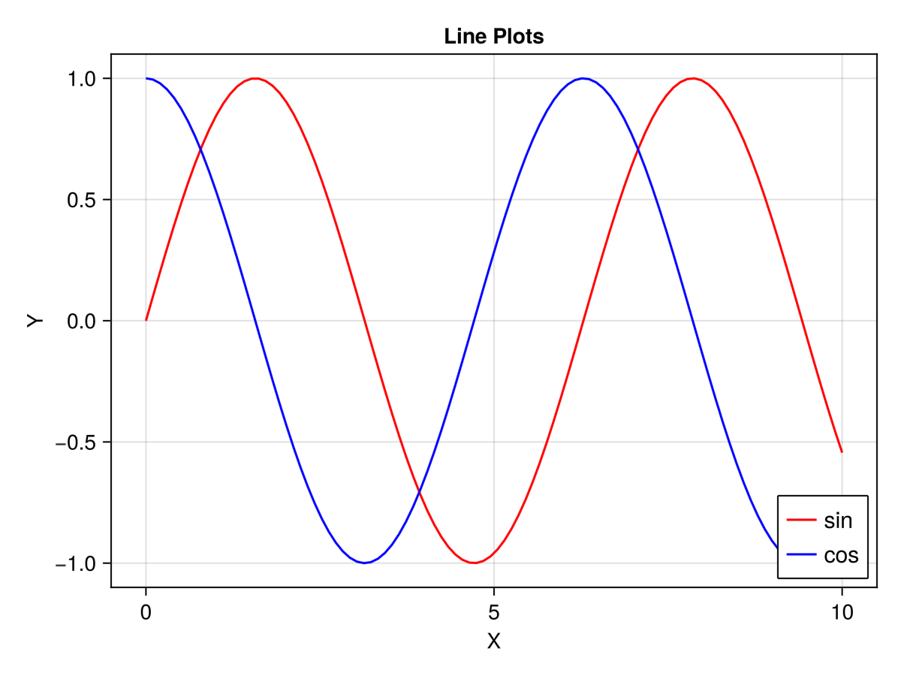


## Adding a Scatter Plot to an Axis and setting the title and labels
This code is written in Julia using the CairoMakie library to create scatter plots. A scatter plot is a type of plot used to display the relationship between two variables, where each point represents an observation. It will generate a figure with two scatter plots, one representing the sin function and the other representing the cos function.
```julia
using CairoMakie

x = range(0, 10, length=100)
fig = Figure()

# Create an axis at the first position of the figure, set the title, x-axis label, and y-axis label
ax = Axis(fig[1, 1], title = "Scatter Plots", xlabel = "X", ylabel = "Y")

# Create a scatter plot on the axis, set the color to red, marker size to 5, and label to "sin"
scatter!(ax, x, sin.(x), color = :red, markersize = 5, label = "sin") 

# Add another scatter plot to the same axis, set the color to blue, marker size to 10, and label to "cos"
scatter!(ax, x, cos.(x), color = :blue, markersize = 10, label = "cos") 

# Set the legend for the axis, position it at the bottom right, and set the label size to 15
axislegend(ax; position = :rb, labelsize = 15)

fig
```
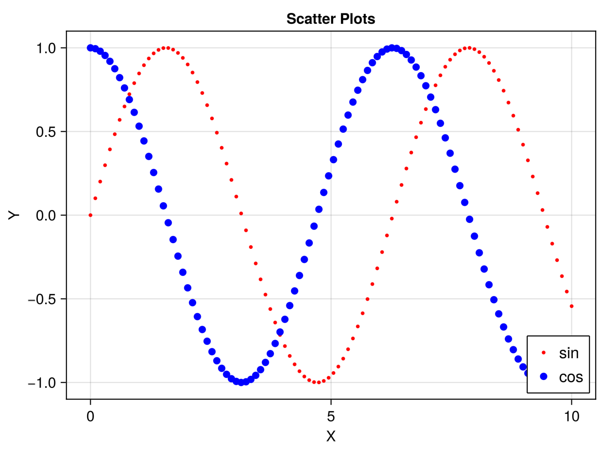

## Create Subplots
Subplots are a way to display multiple plots in different sub-regions of the same window. This Julia code demonstrates how to create multiple subplots using the CairoMakie library. This code will generate a figure with three line plots, each representing the sin function, but with different colors (red, blue, and green).
```julia
using CairoMakie
x = LinRange(0, 10, 100)
y = sin.(x)
fig = Figure()
# Create an axis with title and labels
ax1 = Axis(fig[1, 1], title = "Red Sin Plot", xlabel = "X", ylabel = "Y") 
lines!(ax1, x, y, color = :red, label = "sin")
ax2 = Axis(fig[1, 2], title = "Blue Sin Plot", xlabel = "X", ylabel = "Y")
lines!(ax2, x, y, color = :blue, label = "sin")
# Create a third axis spanning the first two positions of the second row of the figure, set the title, x-axis label, and y-axis label
ax3 = Axis(fig[2, 1:2], title = "Green Sin Plot", xlabel = "X", ylabel = "Y") 
lines!(ax3, x, y, color = :green, label = "sin")

fig
```

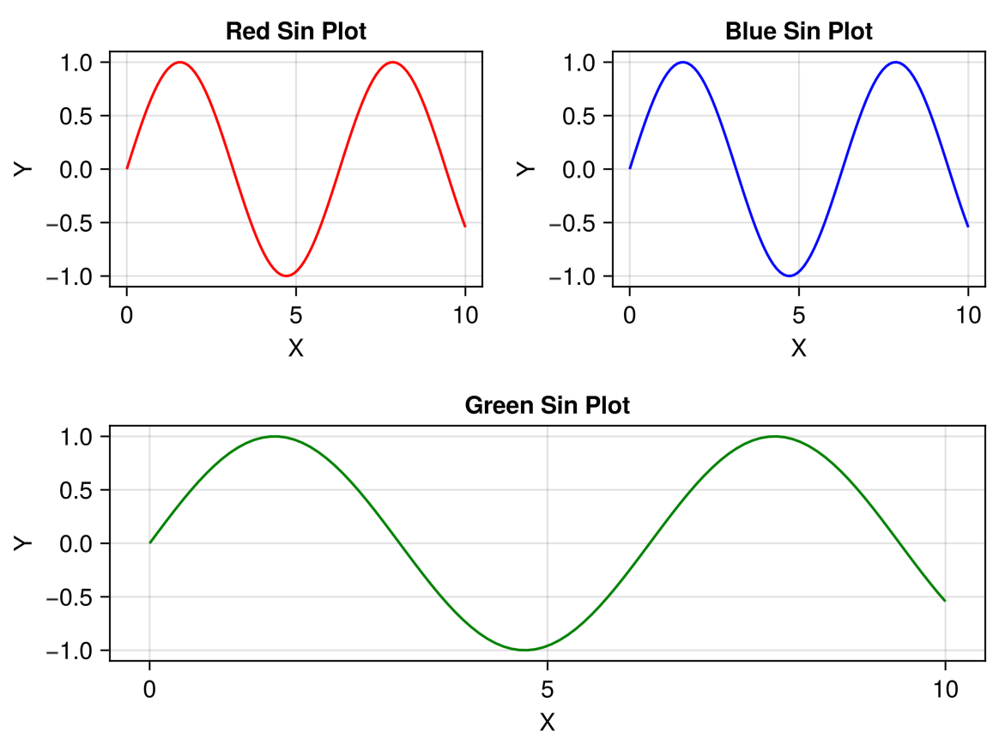

## Heatmap 
A heatmap is a graphical representation of data where individual values contained in a matrix are represented as colors. It is a way of visualizing data density or intensity, making it easier to perceive patterns, trends, and outliers within large data sets.This Julia code shows how to create a heatmap using the CairoMakie. 

### Example(1)
```julia
using CairoMakie
fig = Figure()
# Create an axis with title and labels
ax = Axis(fig[1, 1], title = "Heatmap", xlabel = "X", ylabel = "Y") 
# Create a random heatmap on the axis
hm = heatmap!(ax, randn(20, 20)) 
# Add a colorbar to the right of the heatmap with the label "Color scale"
Colorbar(fig[1, 2], hm, label = "Color scale") 
fig
```

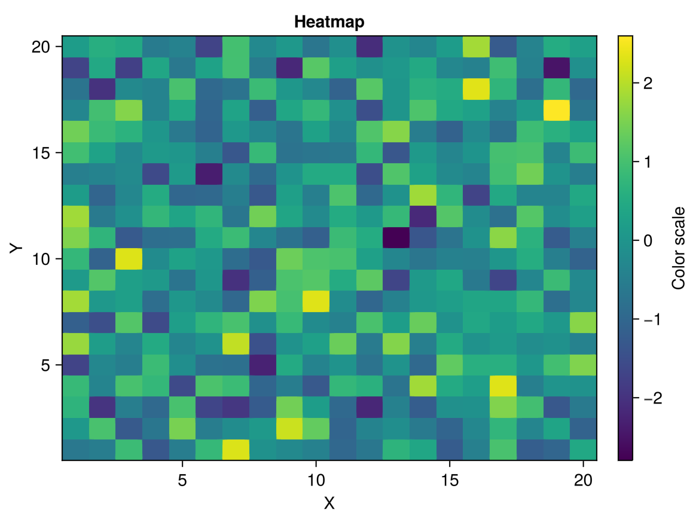


### Example(2)
This code is using CairoMakie to create a heatmap of the Mandelbrot set. The Mandelbrot set is a set of complex numbers for which the function $f(c) = z^2 + c$ does not diverge when iterated from z = 0. This code visualizes the Mandelbrot set by coloring each point according to the number of iterations it takes for the function to diverge at that point.
```julia
using CairoMakie

function mandelbrot(x, y)
    z = c = x + y*im
    for i in 1:30.0; abs(z) > 2 && return i; z = z^2 + c; end; 0
end

heatmap(-2:0.001:1, -1.1:0.001:1.1, mandelbrot,
    colormap = Reverse(:deep))
```
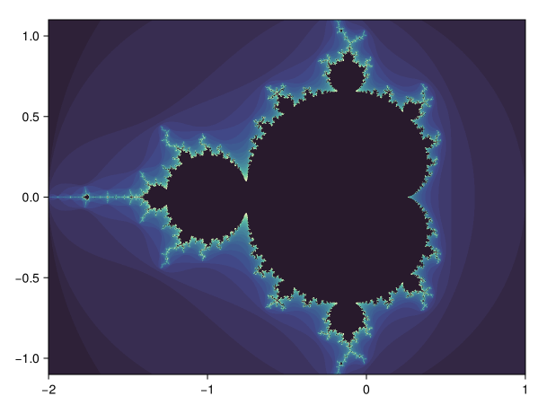


## Contour Plot
A contour plot is a graphical technique used to represent a 3-dimensional surface in two dimensions. It is like a topographical map in which x and y show the location, and the contour lines represent the third dimension (z) by their level.

Each contour line in a contour plot represents a set of points at the same height or value. The contour plot provides a way to visualize the relationship between three continuous variables. The color or the line style often indicates the value of the third variable.
### Example(1)
```julia
using CairoMakie


f = Figure()
Axis(f[1, 1])

# Create a linear range of numbers from 0 to 10, with 100 steps for x-axis
xs = LinRange(0, 10, 100)
# Create a linear range of numbers from 0 to 15, with 100 steps for y-axis
ys = LinRange(0, 15, 100)
zs = [cos(x) * sin(y) for x in xs, y in ys]
# Create a contour plot of the z-values, with contour levels from -1 to 1 in steps of 0.1
contour!(zs,levels=-1:0.1:1)

f
```
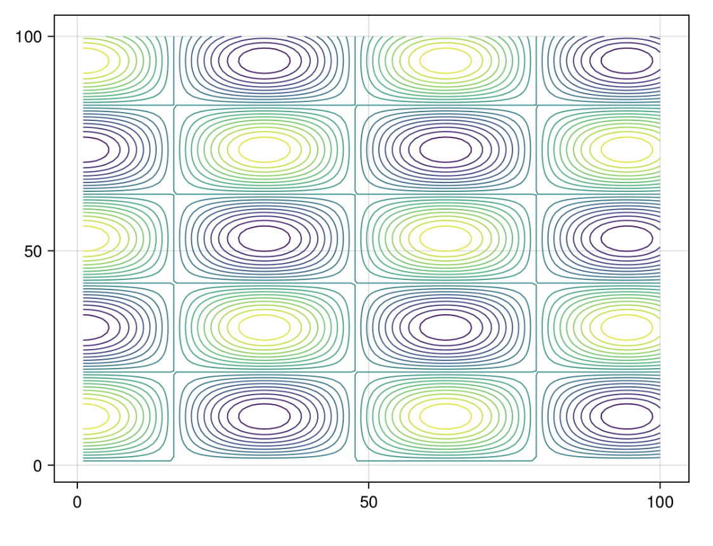

### Example(2)
```julia
using CairoMakie
# Define the Himmelblau function
himmelblau(x, y) = (x^2 + y - 11)^2 + (x + y^2 - 7)^2
x = y = range(-6, 6; length=100)
# Calculate z-values as the Himmelblau function for each combination of x and y
z = himmelblau.(x, y')
# Define the contour levels as powers of 10 from 0.3 to 3.5
levels = 10.0.^range(0.3, 3.5; length=10)
colorscale = ReversibleScale(x -> x^(1 / 10), x -> x^10)
# Create a contour plot of the z-values, with labels, levels, a hsv colormap, and the defined color scale.
f, ax, ct = contour(x, y, z; labels=true, levels, colormap=:hsv, colorscale)
f
```
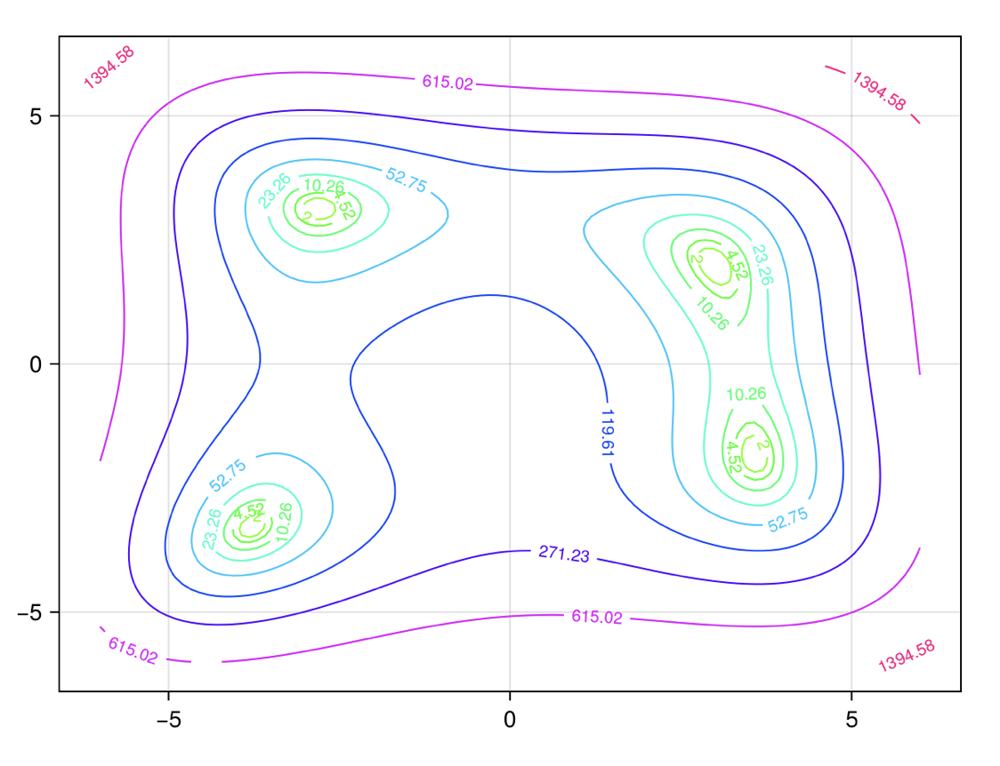


### 3D Contour Plot
```julia
using CairoMakie

f = Figure()
# Create a 3D axis at the first position of the figure, set the aspect ratio and perspective
Axis3(f[1, 1], aspect=(0.5,0.5,1), perspectiveness=0.75)
# Create a linear range of numbers from -0.5 to 0.5, with 100 steps for x and y axes
xs = ys = LinRange(-0.5, 0.5, 100)
zs = [sqrt(x^2+y^2) for x in xs, y in ys]
# Create a 3D contour plot of the negative z-values
contour3d!(-zs, levels=-(.025:0.05:.475), linewidth=2, color=:blue2)
contour3d!(+zs, levels=  .025:0.05:.475,  linewidth=2, color=:red2)

f
```

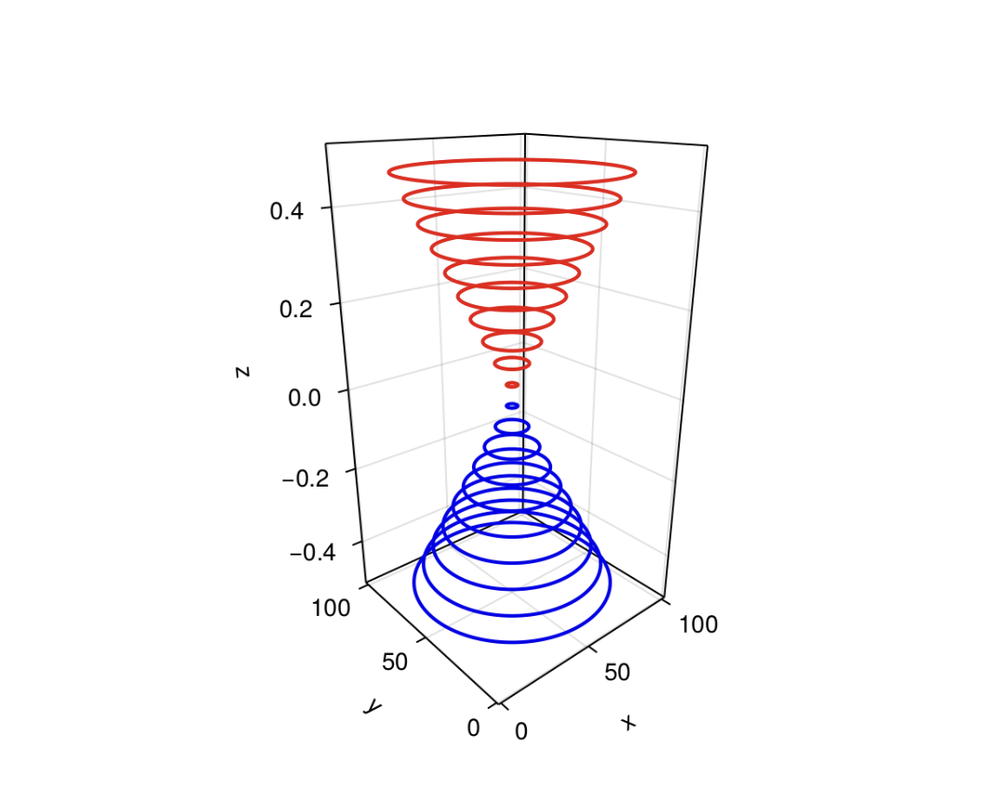


## Colorbar of heatmap/contour Examples   
This Julia code demonstrates how to create heatmaps and contour plots with colorbars using CairoMakie. It first defines a range of x and y values and calculates a corresponding z value for each (x, y) pair. It then creates four subplots: two heatmaps and two contour plots, each with different color maps and level settings. A colorbar is added to each subplot for reference. The `heatmap`, `contourf`, and `Colorbar` functions are used to create the plots and colorbars.
```julia
using CairoMakie

xs = LinRange(0, 20, 50)
ys = LinRange(0, 15, 50)
# Calculate z-values 
zs = [cos(x) * sin(y) for x in xs, y in ys]

fig = Figure()
# Create a heatmap at the first position of the figure and add a colorbar
ax, hm = heatmap(fig[1, 1][1, 1], xs, ys, zs)
Colorbar(fig[1, 1][1, 2], hm)
# Create a second heatmap at the second position of the figure with a grayscale colormap
ax, hm = heatmap(fig[1, 2][1, 1], xs, ys, zs, colormap = :grays,
    colorrange = (-0.75, 0.75), highclip = :red, lowclip = :blue)
Colorbar(fig[1, 2][1, 2], hm)
# Create a filled contour plot at the third position of the figure
ax, hm = contourf(fig[2, 1][1, 1], xs, ys, zs,
    levels = -1:0.25:1, colormap = :heat)
Colorbar(fig[2, 1][1, 2], hm, ticks = -1:0.25:1)
# Create a second filled contour plot
ax, hm = contourf(fig[2, 2][1, 1], xs, ys, zs,
    colormap = :Spectral, levels = [-1, -0.5, -0.25, 0, 0.25, 0.5, 1])
Colorbar(fig[2, 2][1, 2], hm, ticks = -1:0.25:1)

fig
```
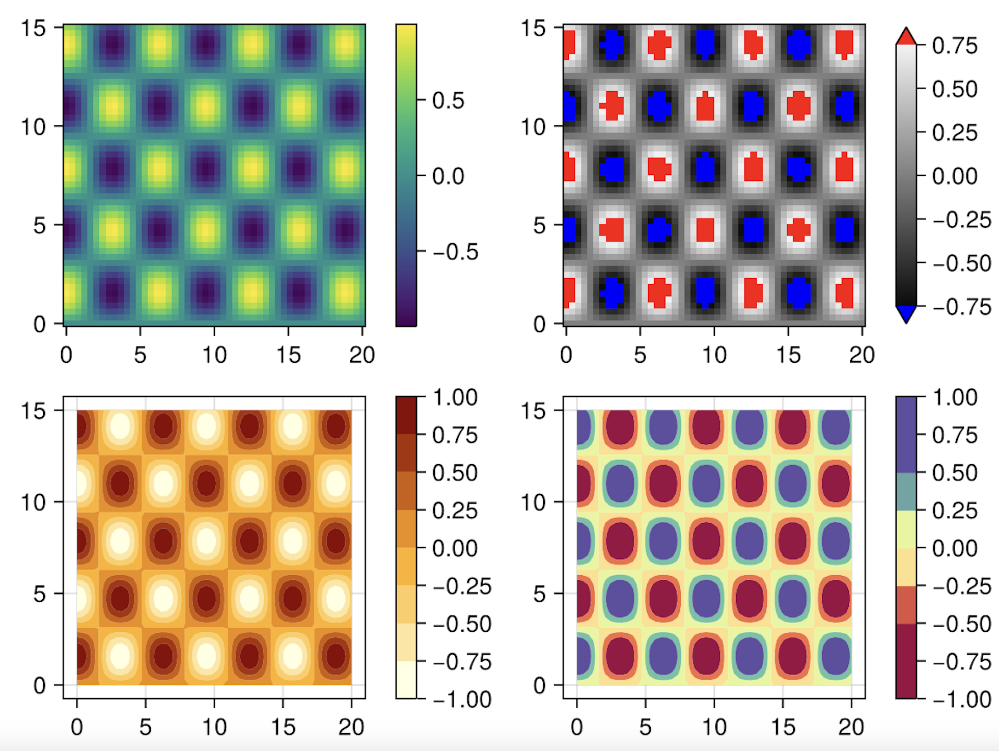


## Arrows examples
An arrow plot, also known as a quiver plot, is a type of plot that displays vector fields. This means it shows the direction and magnitude (strength) of data at different points in space. In these plots, each arrow represents a vector and points in the direction the vector is heading. The length (or color) of the arrow can also represent the magnitude of the vector.

We will introduce how to create 2D and 3D arrows using the CairoMakie library. 

### 2D Arrows
```julia
using CairoMakie

f = Figure(size = (800, 800))
Axis(f[1, 1], backgroundcolor = "black")

xs = LinRange(0, 2pi, 20)
ys = LinRange(0, 3pi, 20)
# Calculate the u-component of the vectors as the sine of x times the cosine of y for each combination of x and y
us = [sin(x) * cos(y) for x in xs, y in ys]
# Calculate the v-component of the vectors as the negative cosine of x times the sine of y for each combination of x and y
vs = [-cos(x) * sin(y) for x in xs, y in ys]
# Calculate the strength (magnitude) of each vector as the square root of the sum of squares of its u and v components
strength = vec(sqrt.(us .^ 2 .+ vs .^ 2))
# Create a quiver plot with the calculated vectors, specified arrow size and length scale, and color the arrows based on their strength
arrows!(xs, ys, us, vs, arrowsize = 10, lengthscale = 0.3,
    arrowcolor = strength, linecolor = strength)

f
```
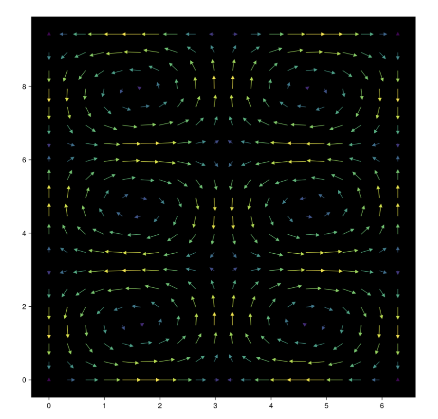


### 3D Plotting


```julia
using GLMakie

using LinearAlgebra
# Create a list of 3D points from -5 to 5 in steps of 2 for x, y, and z coordinates
ps = [Point3f(x, y, z) for x in -5:2:5 for y in -5:2:5 for z in -5:2:5]
# Calculate the direction vectors for each point by swapping the coordinates and scaling by 0.1
ns = map(p -> 0.1 * Vec3f(p[2], p[3], p[1]), ps)
# Calculate the length (norm) of each direction vector
lengths = norm.(ns)
# Create a quiver plot with the calculated points and vectors, turn on anti-aliasing,color the arrows based on their length
# Specify the line width and arrow size, align the arrows at the center, and create a 3D axis 
arrows(
    ps, ns, fxaa=true, # turn on anti-aliasing
    color=lengths,
    linewidth = 0.1, arrowsize = Vec3f(0.3, 0.3, 0.4),
    align = :center, axis=(type=Axis3,)
)
```
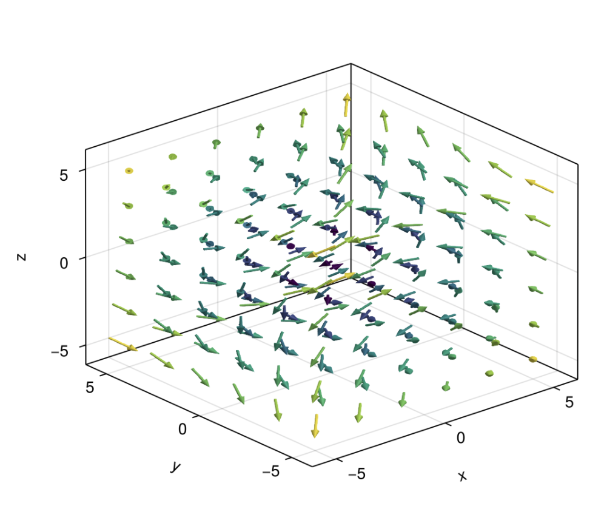

## Bracket
In the context of plotting in Julia with the CairoMakie library, a bracket is a visual element that can be added to a plot to highlight or annotate a specific range of values. Each bracket is customized with different orientations, colors, line styles, and text annotations.

### Example(1)
```julia
using CairoMakie
# Create a line plot of the sine function from 0 to 9, with the x and y grid lines turned off
f, ax, l = lines(0..9, sin; axis = (; xgridvisible = false, ygridvisible = false))
ylims!(ax, -1.5, 1.5)
# Add a bracket to highlight the period length of the sine function, from (pi/2, 1) to (5pi/2, 1), with an offset of 5, and the text "Period length". The bracket style is square.
bracket!(pi/2, 1, 5pi/2, 1, offset = 5, text = "Period length", style = :square)
# Add a bracket to highlight the amplitude of the sine function, with the text "Amplitude". The bracket is oriented downwards, and the text is aligned to the right and centered vertically.
bracket!(pi/2, 1, pi/2, -1, text = "Amplitude", orientation = :down,
    linestyle = :dash, rotation = 0, align = (:right, :center), textoffset = 4, linewidth = 2, color = :red, textcolor = :red)
# Add a bracket to highlight a falling portion of the sine function, from (2.3, sin(2.3)) to (4.0, sin(4.0)), with the text "Falling". The bracket is oriented upwards.
bracket!(2.3, sin(2.3), 4.0, sin(4.0),
    text = "Falling", offset = 10, orientation = :up, color = :purple, textcolor = :purple)
# Add a bracket to highlight a rising portion of the sine function, from (5.5, sin(5.5)) to (7.0, sin(7.0)), with the text "Rising". The bracket is oriented downwards.
bracket!(Point(5.5, sin(5.5)), Point(7.0, sin(7.0)),
    text = "Rising", offset = 10, orientation = :down, color = :orange, textcolor = :orange, 
    fontsize = 30, textoffset = 30, width = 50)
f
```

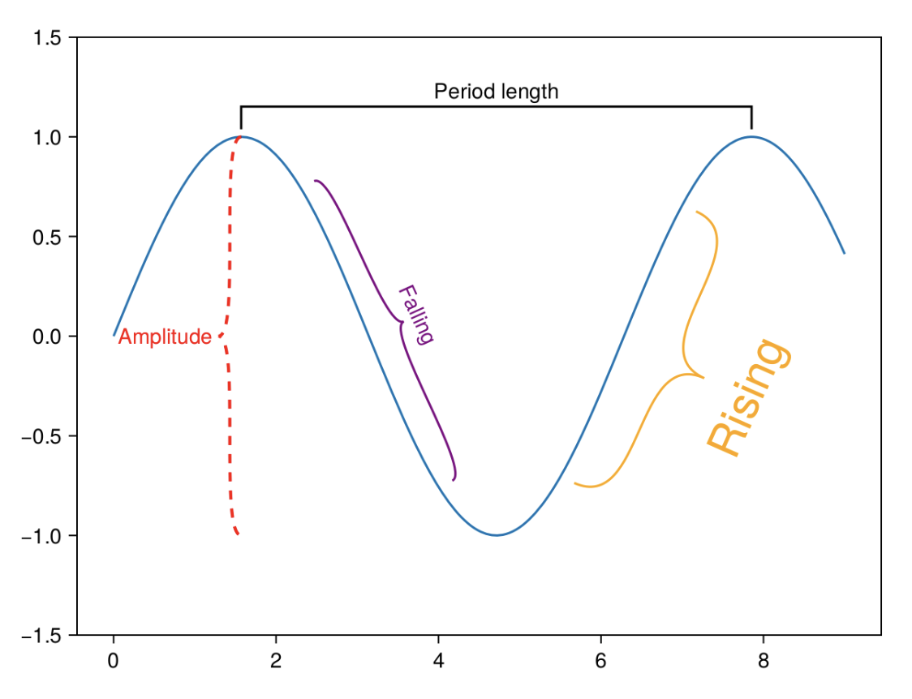

### Example(2)
```julia
using CairoMakie

f = Figure()
ax = Axis(f[1, 1])
# Add a series of brackets to the axis, from (1, 2) to (5, 6) and from (3, 2) to (7, 6), with the text "A" to "E". The brackets are oriented downwards.
bracket!(ax,
    1:5,
    2:6,
    3:7,
    2:6,
    text = ["A", "B", "C", "D", "E"],
    orientation = :down,
)

# Add another series of brackets to the axis, from (i, i-0.7) to (i+2, i-0.7) for i in 1 to 5, with the text "F" to "J". 
bracket!(ax,
    [(Point2f(i, i-0.7), Point2f(i+2, i-0.7)) for i in 1:5],
    text = ["F", "G", "H", "I", "J"],
    color = [:red, :blue, :green, :orange, :brown],
    linestyle = [:dash, :dot, :dash, :dot, :dash],
    orientation = [:up, :down, :up, :down, :up],
    textcolor = [:red, :blue, :green, :orange, :brown],
    fontsize = range(12, 24, length = 5),
)

f
```
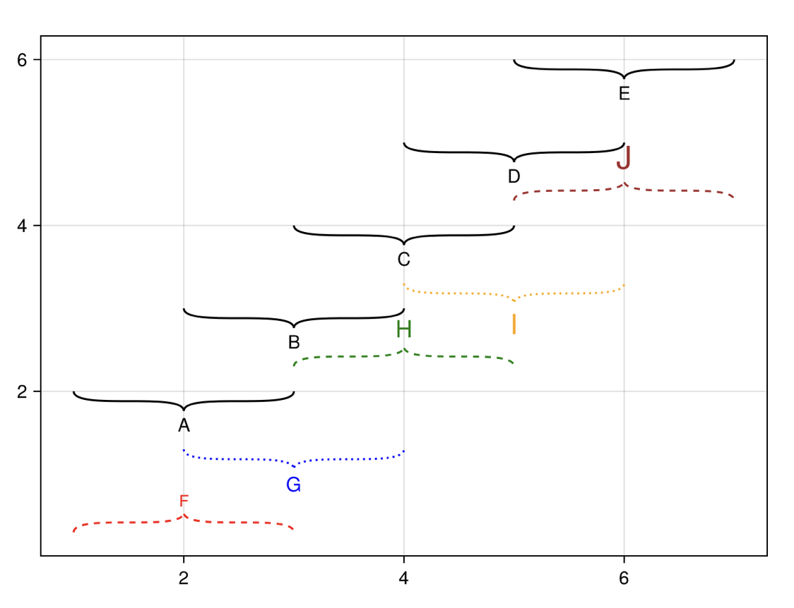


## Error Bars
Error bars are graphical representations used in statistics and data visualization to indicate the variability of data. They are used on graphs to show the uncertainty in a reported measurement. They give a general idea of how precise a measurement is, or conversely, how far from the reported value the true (error-free) value might be.

### Example
```julia
using CairoMakie


f = Figure()
Axis(f[1, 1])

xs = 0:0.5:10
ys = 0.5 .* sin.(xs)
# Define the lower and upper errors for each point. 
lowerrors = fill(0.1, length(xs))
higherrors = LinRange(0.1, 0.4, length(xs))
# Add error bars to the plot, with the color ranging from 0 to 1, and the width of the whiskers set to 10.
errorbars!(xs, ys, lowerrors, higherrors,
    color = range(0, 1, length = length(xs)),
    whiskerwidth = 10)

# plot position scatters so low and high errors can be discriminated
scatter!(xs, ys, markersize = 3, color = :black)

f
```
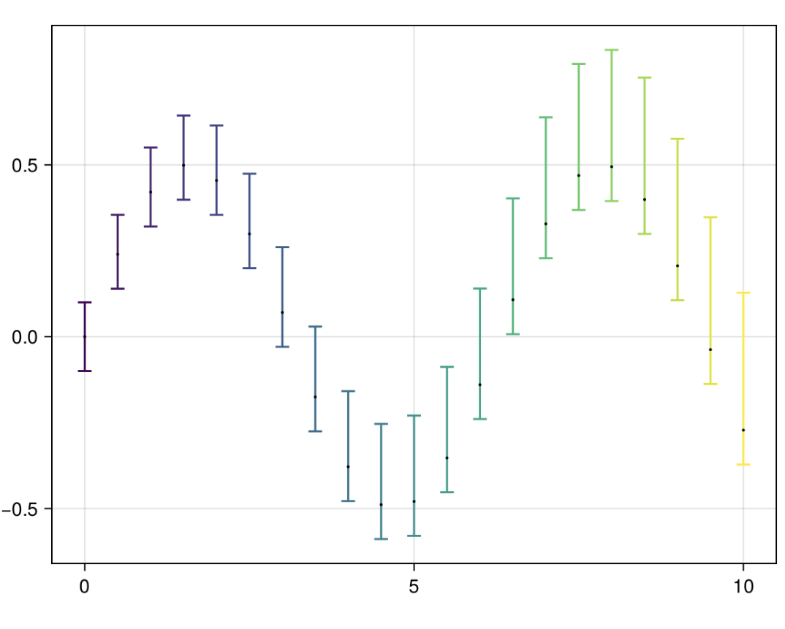

## Streamplot
A streamplot is a type of plot used in fluid dynamics to visualize the flow of a fluid. It shows the direction and magnitude of the flow at different points in space. In a streamplot, the flow is represented by a series of lines that follow the direction of the flow. The density of the lines indicates the speed of the flow, with denser lines indicating faster flow.

### Example
```julia
using CairoMakie

# Define a struct to represent the Fitzhugh-Nagumo model, with parameters ϵ, s, γ, and β
struct FitzhughNagumo{T}
    ϵ::T
    s::T
    γ::T
    β::T
end
# Create an instance of the FitzhughNagumo struct with specific parameter values
P = FitzhughNagumo(0.1, 0.0, 1.5, 0.8)
# Define a function to represent the Fitzhugh-Nagumo model
f(x, P::FitzhughNagumo) = Point2f(
    (x[1]-x[2]-x[1]^3+P.s)/P.ϵ,
    P.γ*x[1]-x[2] + P.β
)
# Define a function to represent the Fitzhugh-Nagumo model with the specific parameter values
f(x) = f(x, P)
# Create a streamplot of the Fitzhugh-Nagumo model in both x and y directions, with the magma colormap
fig, ax, pl = streamplot(f, -1.5..1.5, -1.5..1.5, colormap = :magma)
# Add another streamplot to the figure, with the color set to a function that returns an RGBA color with the alpha channel set to 1
streamplot(fig[1,2], f, -1.5 .. 1.5, -1.5 .. 1.5, color=(p)-> RGBAf(p..., 0.0, 1))
fig
```

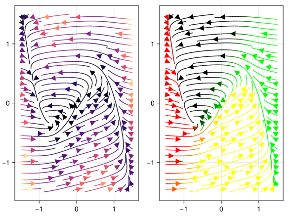


## Text
Text is a common element in plots used to provide information, labels, titles, and annotations. In Julia, text can be added to plots using the CairoMakie library. Text can be positioned at specific coordinates on the plot, aligned to different sides, and styled with different fonts, sizes, colors, and rotations.
### Example
```julia
using CairoMakie

f = Figure()
ax = Axis(f[1, 1])
# Add the first line to the axis, with x ranging from 0 to 10 and y, and add a label
lines!(0..10, x -> sin(3x) / (cos(x) + 2),
    label = L"\frac{\sin(3x)}{\cos(x) + 2}")
# Add the second line to the axis, with x ranging from 0 to 10 and y, and add a label.
lines!(0..10, x -> sin(x^2) / (cos(sqrt(x)) + 2),
    label = L"\frac{\sin(x^2)}{\cos(\sqrt{x}) + 2}")
# Add a legend to the figure
Legend(f[1, 2], ax)

f
```
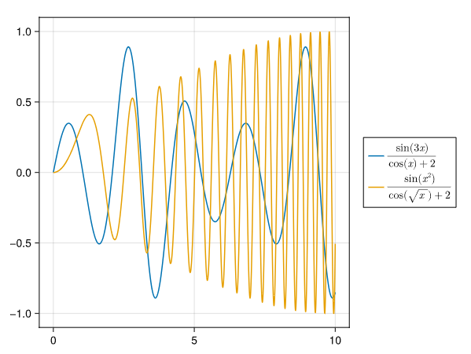


