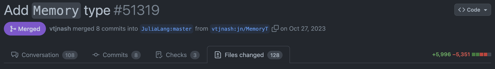

# Correctness - Unit Tests

In terms of scientific computing, accuracy of your result is most certainly more important than anything else.
Checking the correctness is definitely one of the most challenging tasks in software development. Consider the following scenario:

!!! question "The problem of code review"
    Suppose you are one of the maintainers of the Julia programming language. One day, a GitHub user Oscar Smith submitted a [6k-line PR](https://github.com/JuliaLang/julia/pull/51319) to the `JuliaLang/julia` repository:
    

    You want to check if this huge PR did something expected, requiring the following conditions to be satisfied:
    - The build is successfully on Linux, macOS and Windows.
    - No existing feature breaks.
    - The added feature does something expected.

    What would you do?
    1. Checking to the 128 changed files line-by-line with human eye.
    2. Hire a part-time worker, try installing the PR on three fresh machines, and try using as many features as possible and see if anything breaks.
    3. Something more efficient.

In the above scenario, the first option is not reliable for a software project expected to be used by millions of users. The second option is too expensive and time-consuming.
Clever software engineers have come up with a more efficient way to check the correctness of the code, which is to use **Unit Tests** and **CI/CD**.

## Unit Test
[Unit Tests](https://en.wikipedia.org/wiki/Unit_testing) is a software a testing method for the smallest testable **unit** of an application, e.g. functions.
Unit tests are composed of a series of individual test cases, each of which is composed of:
- a collection of inputs and expected outputs for a function.
- an **assertion** statement to verify the function returns the expected output for a given input.

To verify the correctness of the code, we run the unit tests. If the tests pass and the coverage is high, we can be confident that the code is working as expected.
- Tests pass: all assertions in the test cases are true.
- Test coverage: the percentage of the code that is covered by tests, i.e. the higher the coverage, the more **robust** the code is.

In Julia, [Test](https://docs.julialang.org/en/v1/stdlib/Test/) is a built-in package for writing and running unit tests. We will learn how to write and run unit tests in the section [My First Package](@ref).

## Automate your workflow - CI/CD
You still need to set up three clean machines to run the tests. What if you do not have three machines?
The key to solving this problem is to automate the workflow on the cloud with the containerization technology, e.g. [Docker](https://www.docker.com/).
You do not need to configure the dockers on the cloud manually. Instead, you can use a [Continuous Integration/Continuous Deployment (CI/CD)](https://en.wikipedia.org/wiki/CI/CD) service to automate the workflow of
- (CI) **build**, **test** and **merge** the code changes whenever a developer commits code to the repository.
- (CD) **deploy** the code or documentation to a cloud service and **register** the package to the package registry.

CI/CD are often integrated with git hosting services, e.g. [Github Actions](https://docs.github.com/en/actions). A typical CI/CD pipeline include the following steps:
- code updated detected,
- for each task, initialize a virtual machine on the cloud,
- the virtual machine initializes the environment and runs the tests,
- the virtual machine reports the test results.

The tasks of CI/CD are often defined in a configuration file, e.g. `.github/workflows/ci.yml`. We will learn how to set up a CI/CD pipeline in the section [My First Package](@ref).