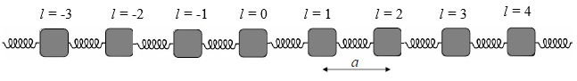

# Matrix Computation

## Matrix multiplication
Matrix multiplication is a fundamental operation in linear algebra. Given two matrices $A\in \mathbb{C}^{m\times n}$ and $B\in \mathbb{C}^{n\times p}$, the product $C = AB$ is defined as
```math
C_{ij} = \sum_{k=1}^n A_{ik}B_{kj}.
```
The time complexity of matrix multiplication is $O(mnp)$.

## System of Linear Equations and LU Decomposition
Let $A\in \mathbb{C}^{n\times n}$ be a invertible square matrix and $b \in \mathbb{C}^n$ be a vector. Solving a linear equation means finding a vector $x\in\mathbb{C}^n$ such that
```math
A x = b
```

!!! note "Example"
    Let us consider the following system of linear equations
    ```math
    \begin{align*}
    2 x_1 + 3 x_2 - 2 x_3 &= 1, \\
    3 x_1 + 2 x_2 + 3 x_3 &= 2, \\
    4 x_1 - 3 x_2 + 2 x_3 &= 3.
    \end{align*}
    ```
    The system of linear equations can be written in matrix form as
    ```math
    \begin{bmatrix}
    2 & 3 & -2 \\
    3 & 2 & 3 \\
    4 & -3 & 2
    \end{bmatrix}
    \begin{bmatrix}
    x_1 \\
    x_2 \\
    x_3
    \end{bmatrix}
    =
    \begin{bmatrix}
    1 \\
    2 \\
    3
    \end{bmatrix}.
    ```

    In Julia, we can solve the system of linear equations using the backslash operator `\` function.

    ```@repl linalg
    A = [2 3 -2; 3 2 3; 4 -3 2]
    b = [1, 2, 3]
    x = A \ b
    A * x
    ```
    The `\` method is implemented with the LU decomposition. It is equivalent to the following code.
    ```@repl linalg
    using LinearAlgebra
    lures = lu(A)  # pivot rows by default
    lures.L * lures.U ≈ lures.P * A

    UpperTriangular(lures.U) \ (LowerTriangular(lures.L) \ (lures.P * b))
    ```

The LU decomposition of a matrix $A\in \mathbb{C}^{n\times n}$ is a factorization of the form
```math
PA = LU
```
where $P$ is a permutation matrix for pivoting the rows of $A$, $L$ is a lower triangular matrix, and $U$ is an upper triangular matrix. Pivoting rows are used to avoid division by zero to ensure numerical stability.
In Julia, linear equations with `UpperTriangular` or `LowerTriangular` matrices will be solved with forward and backward substitution.

To summarize, the algorithm to solve a linear equation contains following steps:

1. Decompose the matrix $PA \in \mathbb{C}^{n\times n}$ into $L \in \mathbb{C}^{n\times n}$ and $U \in \mathbb{C}^{n\times n}$ matrices using a method such as [Gaussian elimination](@ref "LU Factorization with Gaussian Elimination") or Crout's method.

2. Rewrite the equation $Ax = b$ as $LUx = Pb$.

3. Solve for y in $Ly = b$ by [Forward-substitution](@ref). This involves substituting the values of $y$ into the equation one at a time, starting with the first row and working downwards.

4. Solve for $x$ in $Ux = y$ by [Back-substitution](@ref) (link TBA). This involves substituting the values of $x$ into the equation one at a time, starting with the last row and working upwards.

## Least Squares Problem and QR Decomposition

The least squares problem is to find a vector $x\in\mathbb{C}^n$ that minimizes the residual
```math
\|Ax - b\|_2
```
where $A\in \mathbb{C}^{m\times n}$ and $b\in \mathbb{C}^m$.

The QR decomposition of a matrix $A\in \mathbb{C}^{m\times n}$ is a factorization of the form
```math
A = QR
```
where $Q\in \mathbb{C}^{m\times m}$ is an orthogonal matrix and $R\in \mathbb{C}^{m\times n}$ is an upper triangular matrix. The QR decomposition is used to solve the linear least squares problem and to find the eigenvalues of a matrix.

In Julia, we can find the QR decomposition of a matrix using the `qr` function.

```@repl linalg
A = [1 2; 3 4; 5 6]
qr(A)
```

!!! note "Example: data fitting"
    Suppose we have a set of data points

    | $t_i$ | 0.0 | 0.5 | 1.0 | 1.5 | 2.0 | 2.5 | 3.0 | 3.5 | 4.0 | 4.5 |
    |---|---|---|---|---|---|---|---|---|---|----|
    | $y_i$ | 2.9 | 2.7 | 4.8 | 5.3 | 7.1 | 7.6 | 7.7 | 7.6 | 9.4 | 9.0 |

    ```@raw html
    
    ```

    We can fit a quadratic function of the form $y = c_0 + c_1 t + c_2 t^2$ to the data by solving the least squares problem. We can solve the least squares problem by finding the values of $c_0$, $c_1$, and $c_2$ that minimize the sum of the squared residuals
    ```math
    \sum_{i=1}^n (y_i - (c_0 + c_1 t_i + c_2 t_i^2))^2.
    ```
    In matrix form, the least squares problem can be written as
    ```math
    \min_x \|Ax - b\|_2
    ```
    where
    ```math
    A = \begin{bmatrix}
    1 & t_1 & t_1^2 \\
    1 & t_2 & t_2^2 \\
    \vdots & \vdots & \vdots \\
    1 & t_n & t_n^2
    \end{bmatrix},
    x = \begin{bmatrix}
    c_0 \\
    c_1 \\
    c_2
    \end{bmatrix},
    b = \begin{bmatrix}
    y_1 \\
    y_2 \\
    \vdots \\
    y_n
    \end{bmatrix}.
    ```
    By expanding the expression $\|Ax - b\|_2$, we can see that the solution to the least squares problem is given by
    ```math
    x = (A^\dagger A)^{-1} A^\dagger b
    ```
    when $A^\dagger A$ is invertible, where $A^\dagger$ is the Hermitian conjugate of $A$, which is the same as transpose given $A$ is real. 

    ```@repl linalg
    using LinearAlgebra
    time = [0.0, 0.5, 1.0, 1.5, 2.0, 2.5, 3.0, 3.5, 4.0, 4.5];
    y = [2.9, 2.7, 4.8, 5.3, 7.1, 7.6, 7.7, 7.6, 9.4, 9.0];

    A = hcat(ones(length(time)), time, time.^2)
    x = (A' * A) \ (A' * y)
    ```

    The fitted quadratic function is as follows.
    ```@raw html
    
    ```
    However, this approach is not recommended for large matrices due to the poor numerical stability. The condition number of $A^\dagger A$ is the square of the condition number of $A$, which can be very large.
    Instead, we can use the `qr` function to solve the least squares problem.
    ```@repl linalg
    Q, R = qr(A)
    x = R \ (Matrix(Q)' * y)
    ```

## Eigenvalues and Eigenvectors
The eigenvalues and eigenvectors of a matrix $A\in \mathbb{C}^{n\times n}$ are the solutions to the equation
```math
A x = \lambda x
```
where $\lambda$ is a scalar and $x$ is a non-zero vector. The eigenvalues of a matrix can be found by solving the characteristic equation
```math
\det(A - \lambda I) = 0
```
where $I$ is the identity matrix. The eigenvectors can be found by solving the equation $(A - \lambda I)x = 0$.

In Julia, we can find the eigenvalues and eigenvectors of a matrix using the `eigen` function.

```@repl linalg
A = [1 2; 3 4]
eigen(A)
```

!!! note "Example: eigenmodes of a vibrating string (or atomic chain)"
    This example is about solving the dynamics of a vibrating string.
    

    [Image source and main reference](https://lampz.tugraz.at/~hadley/ss1/phonons/1d/1dphonons.php)
    
    The dynamics of a one dimensional vibrating string can be described by the Newton's second law
    ```math
    M \ddot{u} = C(u_{i+1} - u_i) - C(u_i - u_{i-1})
    ```
    where $M$ is the mass matrix, $C$ is the stiffness, and $u_i$ is the displacement of the $i$th atom. The end atoms are fixed, so we have $u_0 = u_{n+1} = 0$.
    We assume all atoms have the same eigenfrequency $\omega$ and the displacement of the $i$th atom is given by
    ```math
    u_i(t) = A_i \cos(\omega t + \phi_i)
    ```
    where $\phi_i$ is the phase of the $i$th atom.
    Then we transform the equation into the eigenvalue problem
    ```math
    \begin{bmatrix}
    -C & C & 0 & \cdots & 0 \\
    C & -2C & C & \cdots & 0 \\
    0 & C & -2C & \cdots & 0 \\
    \vdots & \vdots & \vdots & \ddots & \vdots \\
    0 & 0 & 0 & \cdots & -C
    \end{bmatrix}
    \begin{bmatrix}
    A_1 \\
    A_2 \\
    A_3 \\
    \vdots \\
    A_n
    \end{bmatrix}
    = -\omega^2M
    \begin{bmatrix}
    A_1 \\
    A_2 \\
    A_3 \\
    \vdots \\
    A_n
    \end{bmatrix}
    ```
    The eigenvalues $\omega^2$ are the eigenfrequencies of the vibrating string and the eigenvectors are the eigenmodes of the vibrating string.

    Let us consider a 5-atom vibrating string with $M = C = 1.0$. We can find the eigenvalues and eigenvectors of the mass matrix using the `eigen` function.
    ```@repl linalg
    M = C = 1.0
    C_matrix = [-C C 0 0 0; C -2C C 0 0; 0 C -2C C 0; 0 0 C -2C C; 0 0 0 C -C]
    evals, evecs = LinearAlgebra.eigen(C_matrix);
    second_omega = sqrt(-evals[2]/M)
    second_mode = evecs[:, 2]
    u(t) = second_mode .* cos.(-second_omega .* t) # (ϕi=0)
    u(1.0)  # atom locations offsets at t=1.0
    ```

    By comparing the eigenmodes with the simulation, we can see that the second mode matches the simulation.
    ```@raw html
    
    ```
    For any given initial condition, the displacement of the atoms can be expressed as a linear combination of the eigenmodes. To find a more generic implementation, please check the [source code](https://github.com/GiggleLiu/ScientificComputingForPhysicists/tree/main/lib/PhysicsSimulation).

## Matrix functions

Suppose we have a matrix $A \in \mathbb{C}^{n\times n}$ and an analytic function $f$ defined with a power series

```math
f(A) = \sum_{i=0}^\infty a_i A^i.
```

To compute a matrix function, e.g. $f(A) = e^A$, we can use the following steps:
1. Diagonalize the matrix $A$ as $A = PDP^{-1}$, where $D$ is a diagonal matrix and $P$ is a matrix whose columns are the eigenvectors of $A$.
2. Compute the matrix function $f(A)$ as $f(A) = Pf(D)P^{-1}$.
3. Compute the matrix function $f(D)$ by applying the function $f$ to the diagonal elements of $D$.
4. Compute the matrix function $f(A)$ by multiplying the matrices $P$, $f(D)$, and $P^{-1}$, i.e. $f(A) = P f(D) P^{-1}$.

!!! note "Example"
    Let us consider the matrix
    ```math
    A = \begin{bmatrix}
    1 & 2 \\
    3 & 4
    \end{bmatrix}
    ```
    We can compute the matrix function $e^A$ using the `exp` function.

    ```@repl linalg
    A = [1 2; 3 4]
    exp(A)
    ```
    It is consistent with the result from the eigenvalue decomposition.
    ```@repl linalg
    D, P = LinearAlgebra.eigen(A)
    P * LinearAlgebra.Diagonal(exp.(D)) * inv(P)
    ```

## Singular Value Decomposition
The singular value decomposition (SVD) of a matrix $A\in \mathbb{C}^{m\times n}$ is a factorization of the form
```math
A = U \Sigma V^\dagger
```
where $U\in \mathbb{C}^{m\times m}$ and $V\in \mathbb{C}^{n\times n}$ are orthogonal matrices and $\Sigma\in \mathbb{C}^{m\times n}$ is a diagonal matrix with non-negative real numbers on the diagonal. The singular value decomposition is a generalization of the eigenvalue decomposition for non-square matrices.

In Julia, we can find the singular value decomposition of a matrix using the `svd` function.

```@repl linalg
A = [1 2; 3 4; 5 6]
svd(A)
```

## Cholesky Decomposition
The Cholesky decomposition of a positive definite matrix $A\in \mathbb{C}^{n\times n}$ is a factorization of the form
```math
A = LL^\dagger
```
where $L\in \mathbb{C}^{n\times n}$ is a lower triangular matrix. The Cholesky decomposition is used to solve the linear system of equations $Ax = b$ when $A$ is symmetric and positive definite.

In Julia, we can find the Cholesky decomposition of a matrix using the `cholesky` function.

```@repl linalg
A = [2 1; 1 3]
cholesky(A)
```