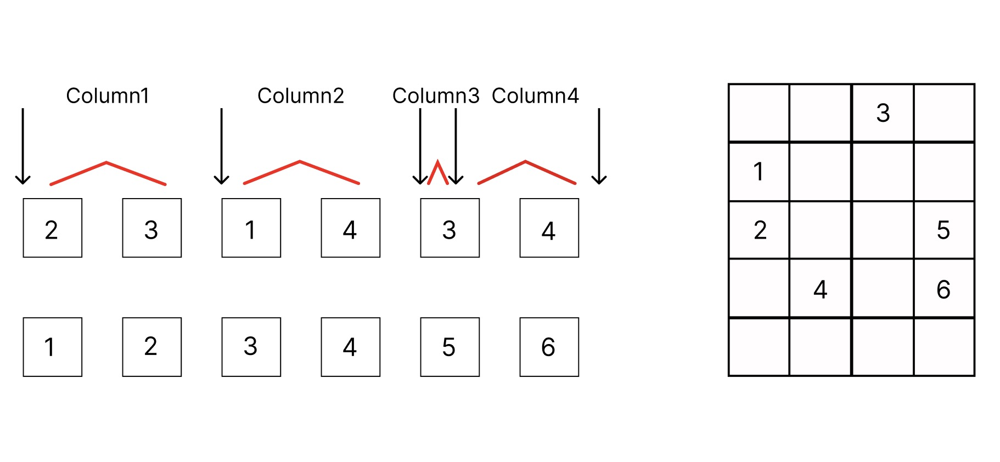

# Sparse Matrices and Graphs

## Sparse Matrices

Matrices are often sparse. Consider the matrix that we used in the [spring chain example](@ref "Eigenvalues and Eigenvectors"), the stiffness matrix is tridiagonal and has only $3n-2$ nonzero elements.
```math
\begin{align*}
A = \begin{pmatrix}
-C & C & 0 & \ldots & 0\\
C & -2C & C & \ldots & 0\\
0 & C & -2C & \ldots & 0\\
\vdots & \vdots & \vdots & \ddots & \vdots\\
0 & 0 & 0 & C & -C
\end{pmatrix}
\end{align*}
```
Storing such a matrix in a dense format requires $n^2$ elements, which is very memory inefficient since it has only $3n-2$ nonzero elements.

## COOrdinate (COO) format

The coordinate format means storing nonzero matrix elements into triples
```math
\begin{align*}
&(i_1, j_1, v_1)\\
&(i_2, j_2, v_2)\\
&\vdots\\
&(i_k, j_k, v_k)
\end{align*}
```

To store the stiffness matrix in COO format, we only need to store $3n-2$ triples.

To implement a COO matrix in Julia, we need to define a new data type and implement the [`AbstractArray`](https://docs.julialang.org/en/v1/manual/interfaces/#man-interface-array) interface.
- `size`: return the size of the matrix
- `getindex`: return the element at the given index

Let the number of nonzero elements in a COO matrix $A$ be ${\rm nnz}(A)$. The indexing operation requires enumerating over all ${\rm nnz}(A)$ elements.

```@example sparse
using LinearAlgebra

struct COOMatrix{Tv, Ti} <: AbstractArray{Tv, 2}   # Julia does not have a COO data type
    m::Ti                   # number of rows
    n::Ti                 # number of columns
    colval::Vector{Ti}   # column indices
    rowval::Vector{Ti}   # row indices
    nzval::Vector{Tv}        # values
    function COOMatrix(m::Ti, n::Ti, colval::Vector{Ti}, rowval::Vector{Ti}, nzval::Vector{Tv}) where {Tv, Ti}
        @assert length(colval) == length(rowval) == length(nzval)
        new{Tv, Ti}(m, n, colval, rowval, nzval)
    end
end

Base.size(coo::COOMatrix) = (coo.m, coo.n)
Base.size(coo::COOMatrix, i::Int) = getindex((coo.m, coo.n), i)
# the number of non-zero elements
nnz(coo::COOMatrix) = length(coo.nzval)

# implement get index for CSC matrix, call with A[i, j]
function Base.getindex(coo::COOMatrix{Tv}, i::Integer, j::Integer) where Tv
    @boundscheck checkbounds(coo, i, j)
    v = zero(Tv)
    for (i2, j2, v2) in zip(coo.rowval, coo.colval, coo.nzval)
        if i == i2 && j == j2
            v += v2  # accumulate the value, since repeated indices are allowed.
        end
    end
    return v
end

function Base.:(*)(A::COOMatrix{T1}, B::COOMatrix{T2}) where {T1, T2}
    @assert size(A, 2) == size(B, 1)
    rowval = Int[]
    colval = Int[]
    nzval = promote_type(T1, T2)[]
    for (i, j, v) in zip(A.rowval, A.colval, A.nzval)
        for (i2, j2, v2) in zip(B.rowval, B.colval, B.nzval)
            if j == i2
                push!(rowval, i)
                push!(colval, j2)
                push!(nzval, v * v2)
            end
        end
    end
    return COOMatrix(size(A, 1), size(B, 2), colval, rowval, nzval)
end
```

```@repl sparse
using Test

stiffmatrix = COOMatrix(3, 3, [1, 1, 2, 2, 2, 3, 3], [1, 2, 1, 2, 3, 2, 3], [-1.0, 1, 1, -2, 1, 1, -1])
size(stiffmatrix)
nnz(stiffmatrix)

dense_matrix = Matrix(stiffmatrix)
@test stiffmatrix * stiffmatrix ≈ dense_matrix ^ 2
```

Most operations on COO matrices are computational expensive. For example, multiplying two COO matrices requires $O({\rm nnz}(A)^2)$ computing time.


## Compressed Sparse Column (CSC) format

A CSC format sparse matrix can be constructed with the `SparseArrays.sparse` function. However, here we will implement a simple CSC matrix from scratch.

```@example sparse
struct CSCMatrix{Tv,Ti} <: AbstractMatrix{Tv}
    m::Int
    n::Int
    colptr::Vector{Ti}
    rowval::Vector{Ti}
    nzval::Vector{Tv}
    function CSCMatrix(m::Int, n::Int, colptr::Vector{Ti}, rowval::Vector{Ti}, nzval::Vector{Tv}) where {Tv, Ti}
        @assert length(colptr) == n + 1
        @assert length(rowval) == length(nzval) == colptr[end] - 1
        new{Tv, Ti}(m, n, colptr, rowval, nzval)
    end
end
Base.size(A::CSCMatrix) = (A.m, A.n)
Base.size(A::CSCMatrix, i::Int) = getindex((A.m, A.n), i)
# the number of non-zero elements
nnz(csc::CSCMatrix) = length(csc.nzval)

# convert a COO matrix to a CSC matrix
function CSCMatrix(coo::COOMatrix{Tv, Ti}) where {Tv, Ti}
    m, n = size(coo)
    # sort the COO matrix by column
    order = sortperm(1:nnz(coo); by=i->coo.rowval[i] + m * (coo.colval[i]-1))
    colptr, rowval, nzval = similar(coo.rowval, n+1), similar(coo.rowval), similar(coo.nzval)
    k = 0
    ipre, jpre = 0, 0
    colptr[1] = 1
    for idx in order
        i, j, v = coo.rowval[idx], coo.colval[idx], coo.nzval[idx]
        # values with the same indices are accumulated
        if i == ipre && j == jpre
            nzval[k] += v
        else
            k += 1
            if j != jpre
                # a new column starts
                colptr[jpre+1:j+1] .= k
            end
            rowval[k] = i
            nzval[k] = v
            ipre, jpre = i, j
        end
    end
    colptr[jpre+1:end] .= k + 1
    resize!(rowval, k)
    resize!(nzval, k)
    return CSCMatrix(m, n, colptr, rowval, nzval)
end

# implement get index for CSC matrix, call with A[i, j]
function Base.getindex(A::CSCMatrix{T}, i::Int, j::Int) where T
    @boundscheck checkbounds(A, i, j)
    for k in nzrange(A, j)
        if A.rowval[k] == i
            return A.nzval[k]
        end
    end
    return zero(T)
end

function Base.:*(A::CSCMatrix{T1}, B::CSCMatrix{T2}) where {T1, T2}
    T = promote_type(T1, T2)
    @assert size(A, 2) == size(B, 1)
    rowval, colval, nzval = Int[], Int[], T[]
    for j2 in 1:size(B, 2)  # enumerate the columns of B
        for k2 in nzrange(B, j2)  # enumerate the rows of B
            v2 = B.nzval[k2]
            for k1 in nzrange(A, B.rowval[k2])  # enumerate the rows of A
                push!(rowval, A.rowval[k1])
                push!(colval, j2)
                push!(nzval, A.nzval[k1] * v2)
            end
        end
    end
    return CSCMatrix(COOMatrix(size(A, 1), size(B, 2), colval, rowval, nzval))
end

# return the range of non-zero elements in the j-th column
nzrange(A::CSCMatrix, j::Int) = A.colptr[j]:A.colptr[j+1]-1
```

```@repl sparse
coo_matrix = COOMatrix(5, 4, [2, 3, 1, 4, 3, 4], [1, 1, 2, 2, 4, 4], [1, 2, 3, 4, 5, 6])
csc_matrix = CSCMatrix(coo_matrix)
```

The `csc_matrix` has type `CSCMatrix`, which contains 5 fields

```@repl sparse
fieldnames(csc_matrix |> typeof)
csc_matrix.m, csc_matrix.n
csc_matrix.colptr
csc_matrix.rowval
csc_matrix.nzval
```



The `m`, `n`, `rowval` and `nzval` have the same meaning as those in the COO format. `colptr` is an integer vector of size $n+1$, where `colptr[j]` is the index in `rowval` and `nzval` of the first nonzero element in the $j$-th column, and `colptr[j+1]` is the index of the first nonzero element in the $(j+1)$-th column. Hence the $j$-th column of the matrix is stored in `rowval[colptr[j]:colptr[j+1]-1]` and `nzval[colptr[j]:colptr[j+1]-1]`.

The number of operations required to index an element in the $j$-th column of a CSC matrix is linear to the nonzero elements in the $j$-th column. To get an element from the 2nd row and 3rd column of a CSC matrix, we can use the following code
```@repl sparse
csc_matrix[2, 3]
```

The row indices and values of nonzero elements in the 3rd column can be obtained by
```@repl sparse
rows3 = csc_matrix.rowval[csc_matrix.colptr[3]:csc_matrix.colptr[4]-1]
val3 = csc_matrix.nzval[csc_matrix.colptr[3]:csc_matrix.colptr[4]-1]
csc_matrix.rowval[nzrange(csc_matrix, 3)] # or equivalently, we can use `nzrange`
```

Multiplying two CSC matrices is much faster than multiplying two COO matrices. The time complexity of multiplying two CSC matrices $A$ and $B$ is $O({\rm nnz}(A){\rm nnz}(B)/n)$.

```@repl sparse
csc_matrix2 = CSCMatrix(COOMatrix(coo_matrix.n, coo_matrix.m, coo_matrix.rowval, coo_matrix.colval, coo_matrix.nzval))  # transpose
@test Matrix(csc_matrix) * Matrix(csc_matrix2) ≈ csc_matrix * csc_matrix2
```

!!! note "Question"
    Can you explain why the above test does not pass?

## Dominant eigenvalue problem

Given a matrix $A \in \mathbb{R}^{n \times n}$, the dominant eigenvalue problem is to find the largest eigenvalue $\lambda_1$ and its corresponding eigenvector $x_1$ such that
```math
A x_1 = \lambda_1 x_1.
```

The power method is a simple iterative algorithm to solve the dominant eigenvalue problem. The algorithm starts with a random vector $v_0$ and repeatedly multiplies it with the matrix $A$.
```math
v_k = A^k v_0
```
By representing the initial vector $v_0$ as a linear combination of eigenvectors of $A$, i.e. $v_0 = \sum_{i=1}^n c_i x_i$, we have
```math
v_k = \sum_{i=1}^n \lambda_i^k c_i x_i
```
where $\lambda_1 > \lambda_2 \geq \ldots \geq \lambda_n$ are the eigenvalues of $A$ and $x_i$ are the corresponding eigenvectors. The power method converges to the eigenvector corresponding to the largest eigenvalue as $k \rightarrow \infty$. The rate of convergence is dedicated by $|\lambda_2/\lambda_1|^k$. The Julia code for the power method is as follows.

```@example sparse
function power_method(A::AbstractMatrix{T}, n::Int) where T
    n = size(A, 2)
    x = normalize!(randn(n))
    for i=1:n
        x = A * x
        normalize!(x)
    end
    return x' * A * x', x
end
```

By inverting the sign, $A\rightarrow -A$, we can use the same method to obtain the smallest eigenvalue.

## The Krylov subspace method

Let $A \in \mathbb{C}^{n \times n}$ be a large sparse matrix, the Arnoldi and Lanczos algorithms can be used to obtain its largest/smallest eigenvalue, with much faster convergence speed comparing with the power method.

The key idea of these algorithms is to generate an orthogonal matrix $Q \in \mathbb{C}^{n\times k}$, $Q^\dagger Q = I$, such that
```math
Q^\dagger A Q = B.
```
We have the following property
```math
\lambda_1(B) \leq \lambda_1(A),
```
where $\lambda_1(A)$ is the largest eigenvalue of $A$. By chooing $Q$ carefully, such that ${\rm span}(Q)$ contains the dominant eigenvectors of $A$, then $\lambda_1(B) = \lambda_1(A)$. When the equality holds, we have
```math
By_1 = \lambda_1(B)y_1
```
where $y_i$ is the $i$-th eigenvector of $B$. By multiplying $y^\dagger$ on the left, we have
```math
y_1^\dagger Q^\dagger A Q y_1 = \lambda_1(B)
```
Hence, the eigenvectors of $B$ are related to the eigenvectors of $A$ by the orthogonal matrix $Q$.

Inspired by the power method, we can define the $Q$ as the *Krylov subspace* that generated from a random initial vector $q_1$.
```math
\mathcal{K}(A, q_1, k) = {\rm span}\{q_1, Aq_1, A^2q_1, \ldots, A^{k-1}q_1\}
```

The Arnoldi and Lanczos algorithm are two special cases of the Krylov subspace method. The Arnoldi algorithm is used to solve the eigenvalue problem, while the Lanczos algorithm is used to solve the symmetric eigenvalue problem.

### KrylovKit.jl
The Julia package [`KrylovKit.jl`](https://github.com/Jutho/KrylovKit.jl) contains many Krylov space based algorithms.
`KrylovKit.jl` accepts general functions or callable objects as linear maps, and general Julia
objects with vector like behavior (as defined in the docs) as vectors.
The high level interface of KrylovKit is provided by the following functions:
*   `linsolve`: solve linear systems
*   `eigsolve`: find a few eigenvalues and corresponding eigenvectors
*   `geneigsolve`: find a few generalized eigenvalues and corresponding vectors
*   `svdsolve`: find a few singular values and corresponding left and right singular vectors
*   `exponentiate`: apply the exponential of a linear map to a vector
*   `expintegrator`: [exponential integrator](https://en.wikipedia.org/wiki/Exponential_integrator)
    for a linear non-homogeneous ODE, computes a linear combination of the `ϕⱼ` functions which generalize `ϕ₀(z) = exp(z)`.

## The Lanczos algorithm

In the Lanczos algorithm, we want to find a orthogonal matrix $Q^T$ such that
```math
Q^T A Q = T
```
where $T$ is a tridiagonal matrix
```math
T = \left(\begin{matrix}
\alpha_1 & \beta_1 & 0 & \ldots & 0\\
\beta_1 & \alpha_2 & \beta_2 & \ldots & 0\\
0 & \beta_2 & \alpha_3 & \ldots & 0\\
\vdots & \vdots & \vdots & \ddots & \vdots\\
0 & 0 & 0 & \beta_{k-1} & \alpha_k
\end{matrix}\right),
```
Let $Q = [q_1 | q_2 | \ldots | q_n],$ and ${\rm span}(\{q_1, q_2, \ldots, q_k\}) = \mathcal{K}(A, q_1, k)$. We have $Aq_k = \beta_{k-1}q_{k-1} + \alpha_k q_k + \beta_k q_{k+1}$, or equivalently in the recursive style
```math
q_{k+1} = (Aq_k - \beta_{k-1}q_{k-1} - \alpha_k q_k)/\beta_k.
```


By multiplying $q_k^T$ on the left, we have
```math
\alpha_k  = q_k^T A q_k.
```
Since $q_{k+1}$ is normalized, we have
```math
\beta_k = \|Aq_k - \beta_{k-1}q_{k-1} - \alpha_k q_k\|_2
```


If at any moment, $\beta_k = 0$, the interation stops due to convergence of a subspace. We have the following reducible form
```math
T(\beta_2 = 0) = \left(\begin{array}{cc|ccc}
\alpha_1 & \beta_1 & 0 & \ldots & 0\\
\beta_1 & \alpha_2 & 0 & \ldots & 0\\
\hline
0 & 0 & \alpha_3 & \ldots & 0\\
\vdots & \vdots & \vdots & \ddots & \vdots\\
0 & 0 & 0 & \beta_{k-1} & \alpha_k
\end{array}\right),
```

### A Julia implementation

```@example sparse
function lanczos(A, q1::AbstractVector{T}; abstol, maxiter) where T
    # normalize the input vector
    q1 = normalize(q1)
    # the first iteration
    q = [q1]
    Aq1 = A * q1
    α = [q1' * Aq1]
    rk = Aq1 .- α[1] .* q1
    β = [norm(rk)]
    for k = 2:min(length(q1), maxiter)
        # the k-th orthonormal vector in Q
        push!(q, rk ./ β[k-1])
        Aqk = A * q[k]
        # compute the diagonal element as αₖ = qₖᵀ A qₖ
        push!(α, q[k]' * Aqk)
        rk = Aqk .- α[k] .* q[k] .- β[k-1] * q[k-1]
        # compute the off-diagonal element as βₖ = |rₖ|
        nrk = norm(rk)
        # break if βₖ is smaller than abstol or the maximum number of iteration is reached
        if abs(nrk) < abstol || k == length(q1)
            break
        end
        push!(β, nrk)
    end
    # returns T and Q
    return SymTridiagonal(α, β), hcat(q...)
end
```

### Reorthogonalization

Let $r_0, \ldots, r_{k-1} \in \mathbb{C}_n$ be linearly independent vectors and the corresponding Householder matrices $H_0, \ldots, H_{k-1}$ such that $(H_0\ldots H_{k- 1})^T [r_0\mid\ldots\mid r_{k-1}]$ is an upper triangular matrix. Let $[q_1 \mid \ldots \mid q_k ]$ denote the first $k$ columns of the Householder product $(H_0 \ldots H_{k-1})$, then $q_1, \ldots, q_k$ are orthonormal vectors up to machine precision. The Lanczos algorithm with complete reorthogonalization is as follows:

```@example sparse
function lanczos_reorthogonalize(A, q1::AbstractVector{T}; abstol, maxiter) where T
    n = length(q1)
    # normalize the input vector
    q1 = normalize(q1)
    # the first iteration
    q = [q1]
    Aq1 = A * q1
    α = [q1' * Aq1]
    rk = Aq1 .- α[1] .* q1
    β = [norm(rk)]
    householders = [householder_matrix(q1)]
    for k = 2:min(n, maxiter)
        # reorthogonalize rk: 1. compute the k-th householder matrix
        for j = 1:k-1
            left_mul!(view(rk, j:n), householders[j])
        end
        push!(householders, householder_matrix(view(rk, k:n)))
        # reorthogonalize rk: 2. compute the k-th orthonormal vector in Q
        qk = zeros(T, n); qk[k] = 1  # qₖ = H₁H₂…Hₖeₖ
        for j = k:-1:1
            left_mul!(view(qk, j:n), householders[j])
        end
        push!(q, qk)
        Aqk = A * q[k]
        # compute the diagonal element as αₖ = qₖᵀ A qₖ
        push!(α, q[k]' * Aqk)
        rk = Aqk .- α[k] .* q[k] .- β[k-1] * q[k-1]
        # compute the off-diagonal element as βₖ = |rₖ|
        nrk = norm(rk)
        # break if βₖ is smaller than abstol or the maximum number of iteration is reached
        if abs(nrk) < abstol || k == n
            break
        end
        push!(β, nrk)
    end
    return SymTridiagonal(α, β), hcat(q...)
end
struct HouseholderMatrix{T} <: AbstractArray{T, 2}
    v::Vector{T}
    β::T
end

# the `mul!` interfaces can take two extra factors.
function left_mul!(B, A::HouseholderMatrix)
    B .-= (A.β .* A.v) * (A.v' * B)
    return B
end

function householder_matrix(v::AbstractVector{T}) where T
    v = copy(v)
    v[1] -= norm(v, 2)
    return HouseholderMatrix(v, 2/norm(v, 2)^2)
end
```

```@repl sparse
using Graphs
n = 1000
graph = random_regular_graph(n, 3)
A = laplacian_matrix(graph)
q1 = randn(n)
tr, Q = lanczos_reorthogonalize(A, q1; abstol=1e-5, maxiter=100)
eigen(tr)

using KrylovKit
eigsolve(A, q1, 2, :SR)
```

### Notes on Lanczos
A sophisticated Lanczos implementation should consider the following aspects:
1. In practice, storing all $q$ vectors is not necessary.
2. Blocking technique can be used to improve the solution, especially when the matrix has degenerate eigenvalues.
3. Restarting technique can be used to improve the solution without increasing the memory usage.

These techniques could be found in Ref.[^Golub2013].

## The Arnoldi algorithm

If $A$ is not symmetric, then the orthogonal tridiagonalization $Q^T A Q = T$ does not exist in general. The Arnoldi approach involves the column by column generation of an orthogonal $Q$ such that $Q^TAQ = H$ is a Hessenberg matrix.
```math
H = \left(\begin{matrix}
h_{11} & h_{12} & h_{13} & \ldots & h_{1k}\\
h_{21} & h_{22} & h_{23} & \ldots & h_{2k}\\
0 & h_{32} & h_{33} & \ldots & h_{3k}\\
\vdots & \vdots & \vdots & \ddots & \vdots\\
0 & 0 & 0 & \ldots & h_{kk}
\end{matrix}\right)
```

That is, $h_{ij} = 0$ for $i>j+1$.


```@example sparse
function arnoldi_iteration(A::AbstractMatrix{T}, x0::AbstractVector{T}; maxiter) where T
    h = Vector{T}[]
    q = [normalize(x0)]
    n = length(x0)
    @assert size(A) == (n, n)
    for k = 1:min(maxiter, n)
        u = A * q[k]    # generate next vector
        hk = zeros(T, k+1)
        for j = 1:k # subtract from new vector its components in all preceding vectors
            hk[j] = q[j]' * u
            u = u - hk[j] * q[j]
        end
        hkk = norm(u)
        hk[k+1] = hkk
        push!(h, hk)
        if abs(hkk) < 1e-8 || k >=n # stop if matrix is reducible
            break
        else
            push!(q, u ./ hkk)
        end
    end

    # construct `h`
    kmax = length(h)
    H = zeros(T, kmax, kmax)
    for k = 1:length(h)
        if k == kmax
            H[1:k, k] .= h[k][1:k]
        else
            H[1:k+1, k] .= h[k]
        end
    end
    return H, hcat(q...)
end
```

```@repl sparse
import SparseArrays
n = 100
A = SparseArrays.sprand(n, n, 0.1)
q1 = randn(n)
h, q = arnoldi_iteration(A, q1; maxiter=20)
eigen(h).values   # naive implementation
eigsolve(A, q1, 2, :LR)  # KrylovKit.eigsolve
```

## Graphs
A graph is a pair $G = (V, E)$, where $V$ is a set of vertices and $E$ is a set of edges. In Julia, the package [`Graphs.jl`](https://github.com/JuliaGraphs/Graphs.jl) provides a simple graph data structure. The following code creates a simple graph with 10 vertices.

```@repl sparse
using Graphs
g = SimpleGraph(10)  # create an empty graph with 10 vertices
add_vertex!(g)  # add a vertex
add_edge!(g, 3, 11)  # add an edge between vertex 3 and 11
has_edge(g, 3, 11)  # check if there is an edge between vertex 3 and 11
rem_vertex!(g, 7)  # remove vertex 7
has_edge(g, 3, 11)
has_edge(g, 3, 7)  # vertex number 11 "renamed" to vertex number 7
neighbors(g, 3)   # get the neighbors of vertex 3
```

A graph can be represented by an adjacency matrix $A \in \mathbb{R}^{n \times n}$, where $n$ is the number of vertices. The element $A_{ij}$ is 1 if there is an edge between vertex $i$ and vertex $j$, and 0 otherwise.

For example, the adjacency matrix of the Petersen graph is

```@repl sparse
using Graphs
graph = smallgraph(:petersen)
adj_matrix = adjacency_matrix(graph)
```


The Laplacian matrix $L_{n\times n}$ of a graph $G$ is defined as $L = D - A$, where $D$ is the degree matrix of the graph. The degree matrix is a diagonal matrix, where the diagonal element $D_{ii}$ is the degree of vertex $i$. The Laplacian matrix is symmetric and positive semidefinite.

```@repl sparse
lap_matrix = laplacian_matrix(graph)
```

### The spectral graph theory

*Theorem*: The number of connected components in the graph is the dimension of the nullspace of the Laplacian and the algebraic multiplicity of the 0 eigenvalue.

```@repl sparse
graphsize = 1000
graph = random_regular_graph(graphsize, 3)
lmat = laplacian_matrix(graph)
q1 = randn(graphsize)
tri, Q = lanczos(lmat, q1; abstol=1e-8, maxiter=100)
-eigen(-tri).values  # the eigenvalues of the tridiagonal matrix
Q' * Q             # the orthogonality of the Krylov vectors
eigsolve(lmat, q1, 2, :SR)  # using function `KrylovKit.eigsolve`
```

NOTE: with larger `graph_size`, you should see some "ghost" eigenvalues 

### Graph layout and clustering
Given a graph, we can use the spectral graph theory to detect the number of connected components and the clustering of the graph. What if we are interested in the clustering of the graph? The spectral clustering algorithm is a popular method to partition a graph into clusters[^Ng2001]. The algorithm is as follows:

Given a set of points $S = \{s_1, \ldots,s_n\}$ in $\mathbb{R^l}$ that we want to cluster into k subsets:
1. Form the affinity matrix $A \in \mathbb{R}^{n\times n}$ defined by $A_{ij} = \exp(-\|s_i -s_j\|_2/2\sigma^2)$ if $i \neq j$, and $A_{ii} = 0$.
2. Define $D$ to be the diagonal matrix whose $(i, i)$-element is the sum of $A$'s $i$-th row, and construct the matrix $L = D^{-1/2}AD^{-1/2}$.
3. Find $x_1 , x_2, \ldots ,x_k$, the $k$ largest eigenvectors of $L$ (chosen to be orthogonal to each other in the case of repeated eigenvalues), and form the matrix $X = [x_1x_2\ldots x_k] \in \mathbb{R}^{n\times n}$ by stacking the eigenvectors in columns.
4. Form the matrix $Y$ from $X$ by renormalizing each of $X$'s rows to have unit length (i.e. $Y_{ij} = X_{ij}/(\sum_j X_{i,j}^2)^{1/2}$).
5. Treating each row of $Y$ as a point in $\mathbb{R}^k$, cluster them into $k$ clusters via K-means or any other algorithm (that attempts to minimize distortion).
6. Finally, assign the original point $S_i$ to cluster $j$ if and only if row $i$ of the matrix $Y$ was assigned to cluster $j$.

Here, the scaling parameter $\sigma^2$ controls how rapidly the affinity $A_{ij}$ falls off with the distance between $s_i$ and $s_j$, and we will later describe a method for choosing it automatically.

For an implementation of the spectral clustering algorithm, please check the [demo](https://github.com/GiggleLiu/ScientificComputingDemos/tree/main/GraphClustering).

[^Golub2013]: Golub, Gene H., and Charles F. Van Loan. Matrix computations. JHU press, 2013.
[^Ng2001]: Ng, Andrew, Michael Jordan, and Yair Weiss. "On spectral clustering: Analysis and an algorithm." Advances in neural information processing systems 14 (2001).