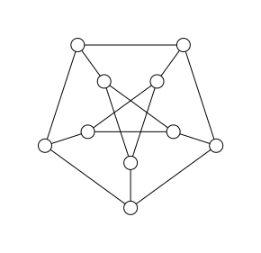

# Computational complexity

This chapter introduces the basic concepts of computational complexity theory. We will discuss the complexity of algorithms and problems and the concept of NP-completeness and the P vs NP problem. We will also discuss several algorithms and techniques for solving hard problems, such as simulated annealing and branch-and-bound algorithms.

## Problems that can be verified in polynomial time

In this section, we want to discuss a seemingly trivially correct statement: *the hardness to solve a problem is not the same as the hardness to verify a solution.*

To narrow the discussion we will focus on decision problems, which are problems that have a yes/no answer. We require that the answer can be verified in polynomial time. This means that given a solution to the problem, we can check whether it is correct in polynomial time. This is known as the class $NP$ (non-deterministic polynomial time).

Even for $NP$ problems, it is not proved that any of them cannot be solved in polynomial time (complexity class $P$). The question of whether $P = NP$ is one of the most famous open problems in computer science. If $P = NP$, then every problem that can be verified in polynomial time can also be solved in polynomial time. If $P \neq NP$, then there are problems that can be verified in polynomial time but cannot be solved in polynomial time.

Maybe the most famous easy to verify but hard to solve problem is the factorization of a number, which is the basis of many cryptographic systems.

!!! example "Factoring a number"
    Given a number and its factors, it is easy to verify that the factors are correct. However, finding the factors in the first place can be very difficult. This is an example of a problem that can be verified in polynomial time, but may not be solvable in time polynomial to the input size (number of bits).

    **Example**
    Given that $x > 1$ and $y > 1$ such that
    ```math
    x \times y = 2033
    ```
    find $x$ and $y$.

    **Solution**
    ```@repl complexity
    function factorize(n)
        for x in 2:floor(Int, sqrt(n))
            if n % x == 0
                return x, n ÷ x
            end
        end
        return nothing   # no factors found
    end
    factorize(2033)
    ```
    This algorithm has a time complexity of $O(\sqrt{n})$. In terms of the number of bits of the input $m \approx \log_2(n)$, the time complexity is $O(2^{m/2})$, which is exponential in the input size.

Factoring a number is a hard problem, but is not as hard as some other problems in NP. It can be shown by **reducing** the factoring problem to a problem that is known to be **NP-complete** (a problem that is at least as hard as any other problem in NP). Here the reduction must be done in polynomial time and the with the solution of the NP-complete problem, we can solve the factoring problem in polynomial time.

In the following, we will discuss a well known NP-complete problem, the **spin-glass problem** and show how the factoring problem can be reduced to the spin-glass problem in polynomial time.

!!! example "Spin-glass problem"
    The spin-glass problem is a problem in statistical mechanics and combinatorial optimization. It is a generalization of the Ising model, where the interactions between the spins are random. The goal is to find the ground state of the system, which is the configuration of spins that minimizes the energy of the system. For integer coupling strength, this problem is NP-complete, which means that it is believed to be computationally intractable in general. To make the statement more rigorous, the decision version of the problem is NP-complete, which means that it is NP-complete to determine whether the energy of the system is below a certain threshold.

    **Example**
    Given a spin-glass that defined on a Petersen graph, the coupling strength is 1. Consider that we use integer variables to store the coupling strength, the size of input is $O(n^2)$ for a general graph of size $n$. Determine whether the energy of the system is below -8?
    

    **Solution**
    In the following, we use the generic tensor network approach to solve this problem.
    ```@repl complexity
    using GenericTensorNetworks, Graphs
    g = smallgraph(:petersen)
    J = ones(Int, 15)
    problem = SpinGlass(g, J)  # problem instance
    tensor_network = GenericTensorNetwork(problem)  # the tensor network with optimized contraction order
    minimum_energy = solve(tensor_network, SizeMin())[]
    optimal_config = solve(tensor_network, SingleConfigMin())[]
    ```
    The tensor network based algorithm has a time complexity of $O(2^{{\rm tw}(G)})$, which is exponential in the treewidth of the graph $G$ - a quantity that upper bounded by the number of vertices. For the Petersen graph, the treewidth is 4. Since in the worst case, the treewidth is $O(n)$, the time complexity is $O(2^n)$, which is exponential in the input size.

!!! example "Hard-core lattice gas"
    The hard-core lattice gas model is a simple model of a gas of particles that interact via hard-core repulsion. The goal is to find the ground state of the system, which is the configuration of particles that maximizes the distance between neighboring particles. The problem is NP-complete, which means that it is believed to be computationally intractable in general.

!!! example "Circuit SAT"
    In theoretical computer science, the circuit satisfiability problem (also known as CIRCUIT-SAT, CircuitSAT, CSAT, etc.) is the decision problem of determining whether a given Boolean circuit has an assignment of its inputs that makes the output true. In other words, it asks whether the inputs to a given Boolean circuit can be consistently set to 1 or 0 such that the circuit outputs 1. If that is the case, the circuit is called satisfiable. Otherwise, the circuit is called unsatisfiable. In the figure to the right, the left circuit can be satisfied by setting both inputs to be 1, but the right circuit is unsatisfiable.

!!! example "Proving a theorem"
    Given a statement and a proof of the statement, it is easy to verify that the proof is correct. However, finding the proof in the first place can be very difficult. This is an example of a problem that can be verified in polynomial time, but may not be solvable in polynomial time.

## Problem reduction

!!! example "Circuit SAT to Spin-glass"
    Please check the demo package: https://github.com/GiggleLiu/ScientificComputingDemos/tree/main/Spinglass

## Algorithm: Tropical tensor network

(WIP)

## Algorithm: Branching and bounding

The branching algorithm is a general algorithm for solving optimization problems. It works by recursively dividing the search space into smaller subspaces and solving each subspace separately. The algorithm starts with the entire search space and divides it into smaller subspaces using a branching rule. It then solves each subspace separately and combines the solutions to find the optimal solution for the entire search space. The algorithm uses a bounding rule to determine when to stop dividing the search space and when to combine the solutions.

Let us use the independent set problem as an example, which is a well-known NP-complete problem. The independent set problem is to find a set of vertices in a graph such that no two vertices are adjacent. The goal is to find the largest independent set in the graph.

The branching algorithm for the independent set problem is as follows:
1. Start with the entire graph $G$.
2. If $G$ is empty, return the empty set.
3. If $G$ has no edges, return all vertices in $G$.
4. Otherwise, choose a vertex $v$ in $G$.
5. Recursively solve the independent set problem on $G - \{v\}$ and $G - N(v)$, where $N(v)$ is the set of neighbors of $v$.
6. Combine the solutions to find the largest independent set in $G$.

!!! example "Branching algorithm for independent set"
    Given a graph $G$ with vertices and edges, find the largest independent set in the graph.

    **Solution**
    ```@repl complexity
    using Graphs
    function mis1(g::SimpleGraph)
        N = nv(g)
        if N == 0
            return 0
        else
            dmin, vmin = findmin(v->degree(g, v), vertices(g))
            return 1 + mapreduce(y->mis1((gi = copy(g); rem_vertices!(gi, neighbors(g, y) ∪ [y]); gi)), max, neighbors(g, vmin) ∪ [vmin])
        end
    end
    mis1(smallgraph(:petersen))
    ```
    The algorithm has a time complexity of $O(2^n)$, which is exponential in the number of vertices in the graph. In the worst case, the algorithm may need to explore all possible subsets of vertices to find the largest independent set.

The algorithm works by dividing the search space into smaller subspaces by removing a vertex $v$ and its neighbors from the graph. It then solves each subspace separately and combines the solutions to find the largest independent set in the original graph. The algorithm uses a bounding rule to determine when to stop dividing the search space and when to combine the solutions.

## Algorithm: Simulated Annealing

Simulated annealing is a probabilistic optimization algorithm that is used to find the global minimum of an energy function. It is inspired by the process of annealing in metallurgy, where a material is heated and then slowly cooled to increase its strength and reduce its defects. The algorithm starts with a thermal state, where the temperature is high and the system is in a random state. It then gradually cools the system, reducing the temperature and allowing the system to settle into a low-energy state. The algorithm uses a probabilistic acceptance criterion, usually based on the Metropolis-Hastings algorithm, to accept or reject moves that increase the energy of the system. This allows the algorithm to escape local minima and explore the energy landscape more effectively.

For the spin-glass problem, the energy function is given by
```math
E(\sigma) = \sum_{(i,j)\in E} J_{ij} \sigma_i \sigma_j
```
where $\sigma_i$ is the spin at site $i$, $J_{ij}$ is the coupling strength between sites $i$ and $j$, and the sum is over all pairs of sites that are connected by an edge in the graph. The goal is to find the ground state of the system, which is the configuration of spins that minimizes the energy of the system.

The simulated annealing algorithm starts with a random initial configuration $\sigma$ and a high temperature $T_H$. The temperature is gradually reduced according to a cooling schedule, such as exponential cooling or linear cooling. For each temperature $T$, the algorithm samples a new configuration $\sigma'$ by flipping a random spin in the current configuration $\sigma$. The algorithm then calculates the change in energy $\Delta E = E(\sigma') - E(\sigma)$ and accepts the move with probability
```math
P(\sigma \to \sigma') = \exp(-\Delta E / T)
```
The algorithm repeats this process for a fixed number of steps or until the system reaches thermal equilibrium. The temperature is then reduced according to a cooling schedule, and the process is repeated until the system converges to a low-energy state.

## Hands-on
The following demo package contains the code for solving the spin-glass problem using the different approaches:
https://github.com/GiggleLiu/ScientificComputingDemos/tree/main/Spinglass
