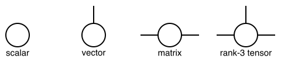
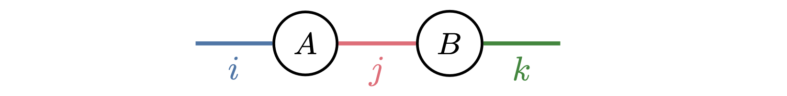
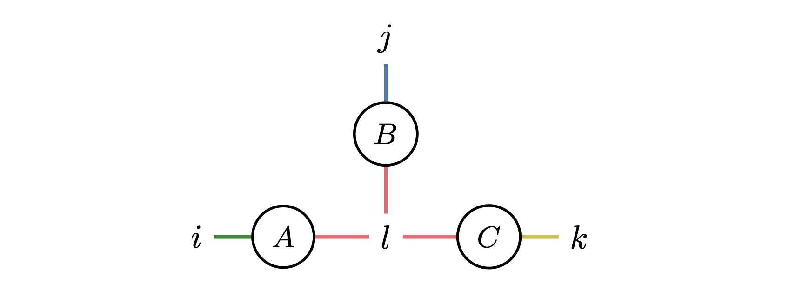
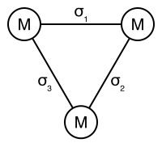

# Tensor Operations

## Background
Tensor networks serve as a fundamental tool for modeling and analyzing correlated systems. This section reviews the fundamental concepts of tensor
networks.

A tensor is a mathematical object that generalizes scalars, vectors, and matrices. It can have multiple dimensions and is used to represent data in various mathematical and physical contexts. It is formally defined as follows:

*Definition* (Tensor): A tensor $T$ associated to a set of discrete variables $V$ is defined as a function that maps each possible instantiation of the variables in its scope $\mathcal{D}_V = \prod_{v\in V} \mathcal{D}_{v}$ to an element in the set $\mathcal{E}$, given by
```math
T_{V}: \prod_{v \in V} \mathcal{D}_{v} \rightarrow \mathcal{E}.
```
Within the context of probabilistic modeling, the elements in $\mathcal{E}$ are non-negative real numbers, while in other scenarios, they can be of generic types. The diagrammatic representation of a tensor is given by a node with the variables $V$ as labels on its edges, as shown below:



*Definition* (Tensor Network): A tensor network is a mathematical framework for defining multilinear maps, which can be represented by a triple $\mathcal{N} = (\Lambda, \mathcal{T}, V_0)$, where:
*  $\Lambda$ is the set of variables present in the network $\mathcal{N}$.
*  $\mathcal{T} = \{ T_{V_k} \}_{k=1}^{K}$ is the set of input tensors, where each tensor $T_{V_k}$ is associated with the labels $V_k$.
*  $V_0$ specifies the labels of the output tensor.

Specifically, each tensor $T_{V_k} \in \mathcal{T}$ is labeled by a set of variables $V_k \subseteq \Lambda$, where the cardinality $|V_k|$ equals the rank of $T_{V_k}$. The multilinear map, or the **contraction**, applied to this triple is defined as
```math
T_{V_0} = \texttt{contract}(\Lambda, \mathcal{T}, V_0) \overset{\mathrm{def}}{=} \sum_{m \in \mathcal{D}_{\Lambda\setminus V_0}} \prod_{T_V \in \mathcal{T}} T_{V|M=m},
```
where $M = \Lambda \setminus V_0$. $T_{V|M=m}$ denotes a slicing of the tensor $T_{V}$ with the variables $M$ fixed to the values $m$. The summation runs over all possible configurations of the variables in $M$.

For instance, matrix multiplication can be described as the contraction of a tensor network given by
```math
(AB)_{\{i, k\}} = \texttt{contract}\left(\{i,j,k\}, \{A_{\{i, j\}}, B_{\{j, k\}}\}, \{i, k\}\right),
```
where matrices $A$ and $B$ are input tensors containing the variable sets $\{i, j\}, \{j, k\}$, respectively, which are subsets of $\Lambda = \{i, j, k\}$. The output tensor is comprised of variables $\{i, k\}$ and the summation runs over variables $\Lambda \setminus \{i, k\} = \{j\}$. The contraction corresponds to
```math
(A B)_{\{i, k\}} = \sum_j A_{\{i,j\}}B_{\{j, k\}}.
```

Diagrammatically, a tensor network can be represented as an *open hypergraph*, where each tensor is mapped to a vertex and each variable is mapped to a hyperedge. Two vertices are connected by the same hyperedge if and only if they share a common variable. The diagrammatic representation of the matrix multiplication is given as follows: 



Here, we use different colors to denote different hyperedges. Hyperedges for $i$ and $k$ are left open to denote variables of the output tensor. A slightly more complex example of this is the star contraction:
```math
\texttt{contract}(\{i,j,k,l\}, \{A_{\{i, l\}}, B_{\{j, l\}}, C_{\{k, l\}}\}, \{i,j,k\}) \\
= \sum_{l}A_{\{i,l\}} B_{\{j,l\}} C_{\{k,l\}}.
```
Note that the variable $l$ is shared by all three tensors, making regular edges, which by definition connect two nodes, insufficient for its representation. This motivates the need for hyperedges, which can connect a single variable to any number of nodes. The hypergraph representation is given as:



## Einsum notation
The einsum notation is a compact way to specify tensor contractions with a string. In this notation, an index (subscripts) is represented by a char, and the tensors are represented by the indices. The input tensors and the output tensor are separated by an arrow `->` and input tensors are separated by comma `,`. For example, the matrix multiplication $\left(\{i,j,k\}, \{A_{\{i, j\}}, B_{\{j, k\}}\}, \{i, k\}\right)$ can be concisely written as `"ij,jk->ik"`. A general contraction can be defined with pseudocode as follows:
```
Let A, B, C, ... be input tensors, O be the output tensor
for indices in domain_of_unique_indices(einsum_notation)
    O[indices in O] += A[indices in A] * B[indices in B] * ...
end
```

In the following example, we demonstrate the einsum notation for matrix multiplication and other tensor operations.

!!! note "Example - Einsum notation"
    We first define the tensors and then demonstrate the einsum notation for various tensor operations.
    ```@repl tensor
    using OMEinsum
    s = fill(1)  # scalar
    w, v = [1, 2], [4, 5];  # vectors
    A, B = [1 2; 3 4], [5 6; 7 8]; # matrices
    T1, T2 = reshape(1:8, 2, 2, 2), reshape(9:16, 2, 2, 2); # 3D tensor
    ```
    Unary examples:
    ```@repl tensor
    ein"i->"(w)  # sum of the elements of a vector.
    ein"ij->i"(A)  # sum of the rows of a matrix.
    ein"ii->"(A)  # sum of the diagonal elements of a matrix, i.e., the trace.
    ein"ij->"(A)  # sum of the elements of a matrix.
    ein"i->ii"(w)  # create a diagonal matrix.
    ein"i->ij"(w; size_info=Dict('j'=>2))  # repeat a vector to form a matrix.
    ein"ijk->ikj"(T1)  # permute the dimensions of a tensor.
    ```

    Binary examples:
    ```@repl tensor
    ein"ij, jk -> ik"(A, B)  # matrix multiplication.
    ein"ijb,jkb->ikb"(T1, T2)  # batch matrix multiplication.
    ein"ij,ij->ij"(A, B)  # element-wise multiplication.
    ein"ij,ij->"(A, B)  # sum of the element-wise multiplication.
    ein"ij,->ij"(A, s)  # element-wise multiplication by a scalar.
    ```

    Nary examples:
    ```@repl tensor
    ein"ai,aj,ak->ijk"(A, A, B)  # star contraction.
    ein"ia,ajb,bkc,cld,dm->ijklm"(A, T1, T2, T1, A)  # tensor train contraction.
    ```

!!! note "Example: Trace under cyclic permutation"
    Consider 3 matrices $A, B, C$ and the cyclic permutation of the trace $\text{Tr}(ABC)$. The trace of a product of matrices is invariant under cyclic permutations, i.e., $\text{Tr}(ABC) = \text{Tr}(CAB) = \text{Tr}(BCA)$. This can be verified using the einsum diagram.

    

    ```@repl tensor
    A, B, C = (randn(2, 2) for i=1:3)
    ein"ij,jk,ik->"(A, B, C) ≈ ein"jk,ik,ij->"(B, C, A)
    ein"ij,jk,ik->"(A, B, C) ≈ ein"ik,ij,jk->"(C, A, B)
    ```


## The spin-glass problem
The spin-glass problem is a combinatorial optimization problem that is widely used in physics, computer science, and mathematics. The problem is to find the ground state of a spin-glass Hamiltonian, which is a function of the spin configuration. The Hamiltonian is defined as
```math
H(\sigma) = \sum_{i,j} J_{ij} \sigma_i \sigma_j + \sum_i h_i \sigma_i,
```
where $\sigma_i \in \{-1, 1\}$ is the spin variable, $J_{ij}$ is the coupling strength between spins $i$ and $j$, and $h_i$ is the external field acting on spin $i$. The first term is the interaction energy between spins, and the second term is the energy due to the external field. The ground state is the spin configuration that minimizes the Hamiltonian.

The topology of the spin-glass system is typically represented as a graph, where the spins are the nodes and the couplings are the edges. The graph can be a complete graph, where every spin is connected to every other spin, or a sparse graph, where only a few spins are connected. The spin-glass problem is NP-hard, and finding the ground state is computationally intractable for large systems.

```@raw html

```

### Partition function
The thermal equilibrium of the spin-glass system is described by the Boltzmann distribution
```math
P(\sigma) = \frac{1}{Z} e^{-\beta H(\sigma)},
```
where $\beta = 1/T$ is the inverse temperature, and $Z$ is the partition function
```math
Z = \sum_{\sigma} e^{-\beta H(\sigma)}.
```
The partition function is the normalization constant that ensures the probability distribution sums to one. The partition function is a sum over all possible spin configurations, which makes it computationally intractable for large systems.

The partition function can be expressed as a tensor contraction using the einsum notation. The partition function is a sum over all possible spin configurations, which can be represented as a tensor contraction over the spins. The partition function can be written as
```math
Z = \sum_{\sigma} e^{-\beta H(\sigma)} = \sum_{\sigma} e^{-\beta \sum_{i,j} J_{ij} \sigma_i \sigma_j + \sum_i h_i \sigma_i} = \sum_{\sigma} \prod_{i,j} e^{-\beta J_{ij} \sigma_i \sigma_j} \prod_i e^{h_i \sigma_i}.
```

After converting the spin-glass Hamiltonian into a tensor contraction, the partition function can be computed efficiently using tensor network libraries. The topology of the tensor network is as follows: the spins are the hyper-edges, and the nodes are the tensors.

```@raw html

```

To demonstrate a simpler example, we consider a spin-glass system with three spins arranged in a triangle.

!!! note "Example: Triangle"
    

    Consider a simple example of a spin-glass system with three spins arranged in a triangle. The Hamiltonian is given by
    ```math
    H(\sigma) = J \sigma_1 \sigma_2 + J \sigma_2 \sigma_3 + J \sigma_3 \sigma_1,
    ```
    where $J$ is the coupling strength. The partition function is given by
    ```math
    Z = \sum_{\sigma} e^{-\beta H(\sigma)} = \sum_{\sigma} e^{-\beta J \sigma_1 \sigma_2 - \beta J \sigma_2 \sigma_3 - \beta J \sigma_3 \sigma_1}.
    ```

    The diagrammatic representation of the tensor network is shown below:
    ```@raw html
    
    ```
    where each node is a tensor of rank 2
    ```math
    M_{ij} = e^{-\beta \sigma_i \sigma_j}
    = \left(\begin{matrix}e^{-\beta} & e^{\beta}\\e^{\beta} & e^{-\beta}\end{matrix}\right)
    ```

    The partition function can be expressed as a tensor contraction using the einsum notation.

    ```@repl tensor
    function partition_function(beta, J)
        M = [exp(-beta * J) exp(beta * J);
            exp(beta * J) exp(-beta * J)]
        Z = ein"(ij,jk),ki->"(M, M, M)[]  # () denotes the order of the contraction.
        return Z
    end
    J = 1.0
    partition_function(2.0, J)
    ```

    The ground state of the spin-glass system is the spin configuration that minimizes the Hamiltonian. From the partition function, we can compute the ground state energy and degeneracy of the ground state.
    ```math
    E_G = \lim_{\beta\rightarrow \infty} - \frac{1}{Z}\frac{\partial Z}{\partial \beta},
    ```
    where $E_G$ is the ground state energy. The degeneracy of the ground state is the number of spin configurations that achieve the minimum energy.

    ```@repl tensor
    using ForwardDiff
    beta = 10.0
    Z = partition_function(beta, J)
    E_G = -ForwardDiff.derivative(b -> partition_function(b, J), beta)/Z
    ```

    The ground state degeneracy can be computed with
    ```math
    S_G = \lim_{\beta\rightarrow \infty} Z/e^{-\beta E_G}.
    ```

    In Julia, the ground state energy and degeneracy can be computed as follows:
    ```@repl tensor
    S_G = Z/exp(-beta * E_G)
    ```

## Ground state finding

The ground state finding problem is to find the spin configuration that minimizes the Hamiltonian.
```math
E_{\rm min} = \min_{\sigma} \left(\sum_{i, j} J_{ij} \sigma_i \sigma_j\right)
```

This is a well-known NP-hard problem, and finding the ground state is computationally intractable for large systems. The ground state can be found approximately using various optimization algorithms, such as simulated annealing. In the following, we introduce the Tropical algorithm for finding the ground state of the spin-glass system exactly.

### Tropical algebra

The tropical algebra is a mathematical structure that generalizes the real numbers. The tropical sum and tropical product are defined as follows:
```math
a \oplus b = \max(a, b), \quad a \otimes b = a + b
```

The tropical zero is $-\infty$, and the tropical one is $0$. The tropical sum is the maximum operation, and the tropical product is the addition operation. The tropical algebra is idempotent, commutative, and associative.

### Tropical tensor network for ground state energy finding
A tropical tensor network is a tensor network where the tensor elements are tropical numbers, such that the original sum-product network becomes a max-plus network. The tropical algebra can be related to the ground state energy of the spin-glass system, which is given by
```math
E_{\rm min} = \lim_{\beta\rightarrow \infty} -\frac{1}{\beta} \log Z = \lim_{\beta\rightarrow \infty} -\frac{1}{\beta} \log \sum_{\sigma} \prod_{i,j} e^{-\beta J_{ij}\sigma_i\sigma_j}
```

Note that
```math
\frac{1}{\beta}\log e^{\beta x}  e^{\beta y} = x+y
```
```math
\frac{1}{\beta}\lim_{\beta \rightarrow \infty}e^{\beta x} + e^{\beta y} = \max(x, y)
```

We have
```math
E_{\rm min} = -\left(\max_{\sigma} \sum_{i,j} -J_{ij}\sigma_i\sigma_j\right)
```
which corresponds to the tropical tensor network contraction.

Instead of using regular tensors, we use the following tropical tensors in the tensor network
```math
T(J_{ij}) = \left(\begin{matrix} -J_{ij} & J_{ij}\\ J_{ij} & -J_{ij}\end{matrix}\right)
```

Let $G = (V, E)$ be the graph of the spin-glass system, where $V$ is the set of spins and $E$ is the set of couplings. The corresponding tropical tensor network is given by
```math
(\Lambda, \mathcal{T}, V_0) = (\{\sigma_i\mid i\in V\}, \{T(J_{ij})_{\sigma_i\sigma_j}\mid (i,j)\in E\}, \{\})
```
The contraction of the above tensor network corresponds to the ground state energy of the spin-glass system.

## Tensor network contraction

Optimizing a tensor network contraction order means reducing the following complexities:
- **Space complexity**: the number of elements in the largest tensor.
- Time complexity: the number of operations to contract a tensor network.
- Read-write complexity: the number of times to read and write tensor elements.

Among which, the space complexity is the most important. However, optimizing which is NP-hard. The following two problems are equivalent (Both are NP-hard to compute):

- Minimum possible tensor rank during the contraction
- Tree width of the dual graph of the tensor network.

### Tree decomposition
Give a graph $G = (V, E)$, a tree decomposition of $G$ is a tree $T$ with nodes $X_1, \dots, X_n$, where each $X_i$ is a subset of $V$, satisfying the following properties:
- The union of all sets $X_i$ equals $V$.
- If $X_i$ and $X_j$ both contain a vertex $v$, then all nodes $X_k$ of $T$ in the (unique) path between $X_i$ and $X_j$ contain $v$ as well.
- For every edge $(v, w)$ in the graph, there is a subset $X_i$ that contains both $v$ and $w$.

To reduce the tensor network contraction complexity, we can optimize the tree width of the dual graph of the tensor network. The tree width of a graph is the smallest tree width over all possible tree decompositions of a graph.
- *Tree width of a tree decomposition*: The largest number of nodes in a clique of a tree decomposition of a graph.
- *Tree width of a graph*: The smallest tree width over all possible tree decompositions of a graph.

Algorithms for optimizing the tensor network contraction order could be found in the [manual of performance tips](https://queracomputing.github.io/GenericTensorNetworks.jl/dev/performancetips/).

### Landscape

Generic tensor network[^Liu2023] provides a unified framework for computing the solution space properties of combinatorial optimization problems. The landscape of the spin-glass problem can be analyzed using tensor networks to understand the structure of the energy landscape and the complexity of the optimization problem. Please refer to the [manual](https://queracomputing.github.io/GenericTensorNetworks.jl/dev/generated/SpinGlass/#Spin-glass-problem) for more details.

## The backward rule of tensor contraction

The backward rule for matrix multiplication is
* `C = ein"ij,jk->ik"(A, B)`
    * `̄A = ein"ik,jk->ij"(̄C, B)`
    * `̄B = ein"ik,jk->ij"(A, ̄C)`
* `v = ein"ii->i"(A)`
    * `̄A = ein"?"(̄v)`


# Probability graph


| **Random variable**  | **Meaning**                     |
|        :---:         | :---                            |
|        A         | Recent trip to Asia             |
|        T         | Patient has tuberculosis        |
|        S         | Patient is a smoker             |
|        L         | Patient has lung cancer         |
|        B         | Patient has bronchitis          |
|        E         | Patient hast T and/or L |
|        X         | Chest X-Ray is positive         |
|        D         | Patient has dyspnoea            |


A probabilistic graphical model (PGM) illustrates the mathematical modeling of reasoning in the presence of uncertainty. Bayesian networks (above) and Markov random fields are popular types of PGMs. Consider the
Bayesian network shown in the figure above known as the *ASIA network*. It is a simplified example from the context of medical
diagnosis that describes the probabilistic relationships between different
random variables corresponding to possible diseases, symptoms, risk factors and
test results. It consists of a graph ``G = (V,\mathcal{E})`` and a
probability distribution ``P(V)`` where ``G`` is a directed acyclic graph,
``V`` is the set of variables and ``\mathcal{E}`` is the set of edges
connecting the variables. We assume all variables to be discrete (0 or 1). Each variable ``v \in V`` is quantified with a *conditional probability distribution* ``P(v \mid
pa(v))`` where ``pa(v)`` are the parents of ``v``. These conditional
probability distributions together with the graph ``G`` induce a *joint
probability distribution* over ``P(V)``, given by
```math
P(V) = \prod_{v\in V} P(v \mid pa(v)).
```

## The partition function
[https://uaicompetition.github.io/uci-2022/competition-entry/tasks/](https://uaicompetition.github.io/uci-2022/competition-entry/tasks/)

## References
[^Liu2023]: Liu, Jin-Guo, et al. "Computing solution space properties of combinatorial optimization problems via generic tensor networks." SIAM Journal on Scientific Computing 45.3 (2023): A1239-A1270.